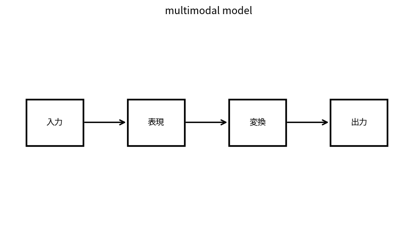

# multimodal model

Course 09｜深層学習｜Topic 17/20

---
layout: center
---

## 今回の問い

## 到達目標

- 定義と代表式を、自分の言葉と記号で説明できる。
- 成立条件を確認し、手計算と結果を検算できる。

## 理解確認

- 定義・条件・計算結果を自分の言葉で説明できるか確認する。

multimodal modelの代表式は、どの定義・仮定から、なぜその形になるのか。

---

## なぜ今これを学ぶのか

前Topic `dl-graph-neural-networks` で得た概念を使い、ここでは multimodal model へ進む。

---

## 直感

multimodal modelは異なるmodalityを共通表現空間へ写し、対応するtext/imageなどを近づける。

---

## 図解

2つのembedding群を共通平面でpairごとに線で結ぶ。 画像・文字など異なるencoderの表現を共通空間またはcross-attentionで結び、片方の情報がもう片方の予測へ流れる。

---

## 記号と代表式

- $z_{text},z_{image}\in\mathbb R^d$
- $s=cos(z_t,z_i)$
- paired data

$$
s(\mathbf{z}_{text},\mathbf{z}_{image})=\frac{\mathbf{z}_{text}^{\mathsf T}\mathbf{z}_{image}}{\|\mathbf{z}_{text}\|\|\mathbf{z}_{image}\|}
$$

---

## 導出 1

text/imageを別encoderでsame d embeddingsへ。

---

## 導出 2

matched pair similarityをhigh、unmatched lowにするInfoNCEでspacesをalign。

---

## 例題

image-caption retrievalでmatched cosineをmaximize。

---

## 条件を変えるとどうなるか

alignment score高でもmodality-specific detailが失われる場合。paired dataset bias。

---

## よくある誤解

multimodal modelでは、式へ数値を代入するだけでは不十分である。alignment score高でもmodality-specific detailが失われる場合。paired dataset bias。 という失敗例が示すように、式を使える条件と結論の範囲を区別する必要がある。

---

## 実装・計算上の注意

normalization、temperature、batch negatives、token count imbalance。

---

## 一段先へ

大規模trainingではdata/parameterをdevicesへ分散しgradient aggregationが必要。

---

## 自分で説明できるか

- 「dual encoder」を式を見ずに説明できるか
- 「cross-attention fusion」までの論理を一段ずつ再現できるか
- multimodal modelの条件を1つ外した反例を説明できるか

---
layout: center
---

## 教科書と演習

- [教科書](../../textbook/dl-multimodal-models)
- [10問の演習](../../exercises/dl-multimodal-models)
