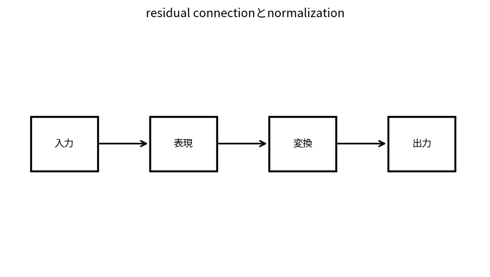

# residual connectionとnormalization

Course 09｜深層学習｜Topic 10/20

---
layout: center
---

## 今回の問い

## 到達目標

- 定義と代表式を、自分の言葉と記号で説明できる。
- 成立条件を確認し、手計算と結果を検算できる。

## 理解確認

- 定義・条件・計算結果を自分の言葉で説明できるか確認する。

residual connectionとnormalizationの代表式は、どの定義・仮定から、なぜその形になるのか。

---

## なぜ今これを学ぶのか

前Topic `dl-transformers` で得た概念を使い、ここでは residual connectionとnormalization へ進む。

---

## 直感

normalizationは中間表現のスケールを整え、residual connectionは恒等経路を残して深いnetworkの学習を助ける。

---

## 図解

層を通る前後のactivation分布を比較する。 層へ入るactivation分布と正規化後の分布を比較する。尺度を制御することでoptimization landscapeとgradient scaleを扱いやすくする。

---

## 記号と代表式

- $y=x+F(x)$：residual block
- $J=I+J_F$：local Jacobian
- $LN(x)$：feature-wise normalization

$$
\mathbf{y}=\mathbf{x}+F(\mathbf{x})
$$

---

## 導出 1

F=0ならblockはexact identity。deep stackが少なくともinformationを通すparameterizationを持つ。

---

## 導出 2

Jacobian $I+J_F$ なのでbackpropにidentity contributionがあり、pure product J_Fのみよりgradient propagationを助ける。

---

## 例題

100 blocksでもeach residual smallならstateはincremental updatesとして変化。

---

## 条件を変えるとどうなるか

residualならgradient problemが完全解決するわけではなくscale/init/depthでinstability。

---

## よくある誤解

residual connectionとnormalizationでは、式へ数値を代入するだけでは不十分である。residualならgradient problemが完全解決するわけではなくscale/init/depthでinstability。 という失敗例が示すように、式を使える条件と結論の範囲を区別する必要がある。

---

## 実装・計算上の注意

eps, RMSNorm vs LayerNorm, residual scalingをconfig確認。

---

## 一段先へ

representationをlatent variableとしてprobabilisticにmodelするVAEへ。

---

## 自分で説明できるか

- 「identity solution」を式を見ずに説明できるか
- 「LayerNorm」までの論理を一段ずつ再現できるか
- residual connectionとnormalizationの条件を1つ外した反例を説明できるか

---
layout: center
---

## 教科書と演習

- [教科書](../../textbook/dl-normalization-residuals)
- [10問の演習](../../exercises/dl-normalization-residuals)
