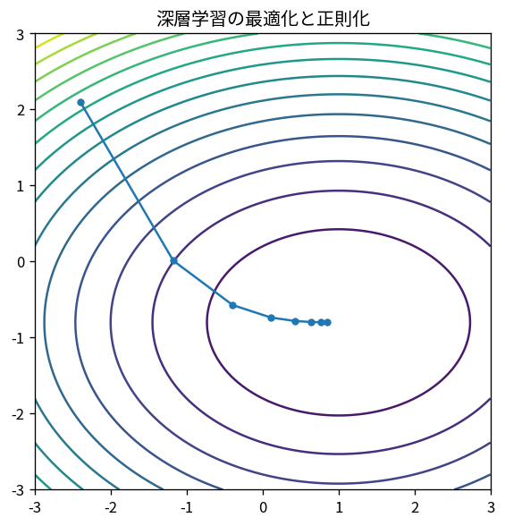

# 深層学習の最適化と正則化

Course 09｜深層学習｜Topic 05/20

---
layout: center
---

## 今回の問い

## 到達目標

- 定義と代表式を、自分の言葉と記号で説明できる。
- 成立条件を確認し、手計算と結果を検算できる。

## 理解確認

- 定義・条件・計算結果を自分の言葉で説明できるか確認する。

深層学習の最適化と正則化の代表式は、どの定義・仮定から、なぜその形になるのか。

---

## なぜ今これを学ぶのか

前Topic `dl-initialization-normalization` で得た概念を使い、ここでは 深層学習の最適化と正則化 へ進む。

---

## 直感

確率的最適化は全データ勾配の代わりにノイズを含む推定勾配を使い、計算量と分散を交換する。

---

## 図解

full gradientとmini-batch軌跡を比較する。 full gradientの滑らかな軌跡に対しmini-batch gradientは揺らぐが、期待的には同じ下降方向を推定する。学習率は進む速さとノイズ平均化の両方を制御する。

---

## 記号と代表式

- $w_k$：parameters
- $g_k$：mini-batch gradient
- $m_k,v_k$：Adam moments
- $\lambda$：weight decay

$$
\mathbf{w}_{k+1}=\mathbf{w}_k-\eta\frac{\hat{\mathbf{m}}_k}{\sqrt{\hat{\mathbf{v}}_k}+\varepsilon}
$$

---

## 導出 1

full objective gradientのestimateとしてg_k。batch noiseは探索を助ける場合もあるがvariance source。

---

## 導出 2

EMA first/second momentsから $\hat m/(\sqrt{\hat v}+ε)$ でcoordinate scale調整。

---

## 例題

train loss低下中でもval loss上昇ならoverfit。early stoppingはtraining timeをregularizerとして使う。

---

## 条件を変えるとどうなるか

optimizerを変えてtraining lossが速く下がることとtest performanceが良いことは同義でない。

---

## よくある誤解

深層学習の最適化と正則化では、式へ数値を代入するだけでは不十分である。optimizerを変えてtraining lossが速く下がることとtest performanceが良いことは同義でない。 という失敗例が示すように、式を使える条件と結論の範囲を区別する必要がある。

---

## 実装・計算上の注意

gradient clipping、mixed precision loss scaling、scheduler、optimizer state checkpoint。

---

## 一段先へ

次にarchitecture-specific inductive biasとしてlocal translation structureを使うCNNへ。

---

## 自分で説明できるか

- 「mini-batch gradient」を式を見ずに説明できるか
- 「weight decay」までの論理を一段ずつ再現できるか
- 深層学習の最適化と正則化の条件を1つ外した反例を説明できるか

---
layout: center
---

## 教科書と演習

- [教科書](../../textbook/dl-optimization-regularization)
- [10問の演習](../../exercises/dl-optimization-regularization)
