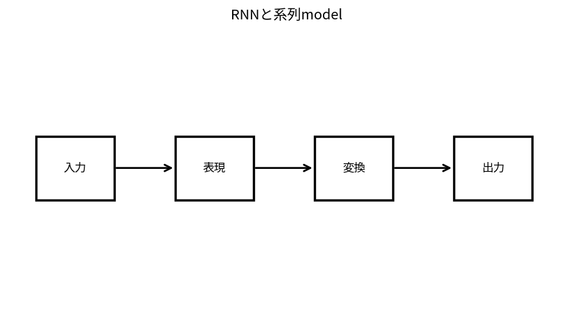

# RNNと系列model

Course 09｜深層学習｜Topic 07/20

---
layout: center
---

## 今回の問い

## 到達目標

- 定義と代表式を、自分の言葉と記号で説明できる。
- 成立条件を確認し、手計算と結果を検算できる。

## 理解確認

- 定義・条件・計算結果を自分の言葉で説明できるか確認する。

RNNと系列modelの代表式は、どの定義・仮定から、なぜその形になるのか。

---

## なぜ今これを学ぶのか

前Topic `dl-cnn-convolution` で得た概念を使い、ここでは RNNと系列model へ進む。

---

## 直感

系列modelは時刻ごとの入力と過去状態を組み合わせ、順序依存の情報を保持する。

---

## 図解

時系列nodeを左から右へつなぎ、hidden stateが伝わる様子を見る。 時刻tのhidden stateが過去情報を次時刻へ運ぶ。長い依存では同じJacobian積が繰り返されるためgradientが消失・爆発しやすい。

---

## 記号と代表式

- $x_t$：time t input
- $h_t$：hidden state
- $W_h,W_x$
- $h_t=\phi(W_hh_{t-1}+W_xx_t)$

$$
\mathbf{h}_t=\phi(\mathbf{W}_h\mathbf{h}_{t-1}+\mathbf{W}_x\mathbf{x}_t)
$$

---

## 導出 1

$h_t=F(h_{t-1},x_t)$ をunrollするとh_tはx_1…x_tのnested composition。

---

## 導出 2

同じW_h,W_xを全tで使うためsequence lengthにparameter数が比例しない。

---

## 例題

scalar h_t=0.5h_{t-1}+x_tでは古いinput contributionは0.5^{lag}で指数減衰。

---

## 条件を変えるとどうなるか

hidden stateがfixed sizeなのでlong context情報を全て保持できる保証はない。

---

## よくある誤解

RNNと系列modelでは、式へ数値を代入するだけでは不十分である。hidden stateがfixed sizeなのでlong context情報を全て保持できる保証はない。 という失敗例が示すように、式を使える条件と結論の範囲を区別する必要がある。

---

## 実装・計算上の注意

mask/padded length、state detach、truncated BPTT、gradient clipping。

---

## 一段先へ

各queryがsequence内の任意positionを直接参照できるattentionへ。

---

## 自分で説明できるか

- 「recurrent composition」を式を見ずに説明できるか
- 「BPTT gradient」までの論理を一段ずつ再現できるか
- RNNと系列modelの条件を1つ外した反例を説明できるか

---
layout: center
---

## 教科書と演習

- [教科書](../../textbook/dl-rnn-sequence-models)
- [10問の演習](../../exercises/dl-rnn-sequence-models)
