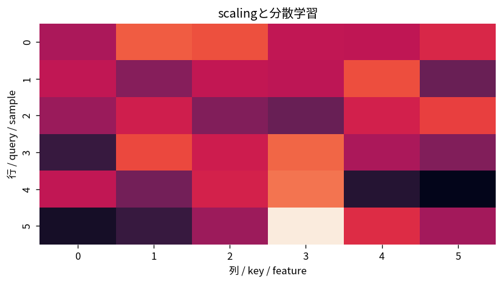

# scalingと分散学習

Course 09｜深層学習｜Topic 18/20

---
layout: center
---

## 今回の問い

## 到達目標

- 定義と代表式を、自分の言葉と記号で説明できる。
- 成立条件を確認し、手計算と結果を検算できる。

## 理解確認

- 定義・条件・計算結果を自分の言葉で説明できるか確認する。

scalingと分散学習の代表式は、どの定義・仮定から、なぜその形になるのか。

---

## なぜ今これを学ぶのか

前Topic `dl-multimodal-models` で得た概念を使い、ここでは scalingと分散学習 へ進む。

---

## 直感

分散学習は複数deviceでgradientやparameterを分担し、通信と計算を同期させる。

---

## 図解

複数workerのgradientがall-reduceで平均される流れを描く。 同じmodelのgradientを複数workerで計算して集約するdata parallelと、model自体を分割するmodel parallelの通信位置が異なる。

---

## 記号と代表式

- $P$：workers
- $g_p$：worker gradient
- $g=P^{-1}\sum g_p$
- data/model/tensor parallelism

$$
\mathbf{g}=\frac{1}{P}\sum_{p=1}^{P}\mathbf{g}_p
$$

---

## 導出 1

global batch loss meanはall samples gradient average。worker equal batchならlocal meansをaverage。

---

## 導出 2

communicationでsum/averageし全replica同じupdate。

---

## 例題

8 GPUs each batch32→global batch256。learning-rate retuningが必要な場合。

---

## 条件を変えるとどうなるか

gradient averageをsumのまま使うとeffective learning rateがP倍になるframework conventionがある。

---

## よくある誤解

scalingと分散学習では、式へ数値を代入するだけでは不十分である。gradient averageをsumのまま使うとeffective learning rateがP倍になるframework conventionがある。 という失敗例が示すように、式を使える条件と結論の範囲を区別する必要がある。

---

## 実装・計算上の注意

DDP synchronization, mixed precision, checkpoint sharding, determinism。

---

## 一段先へ

training/inference costを下げるlow-rank adapters, quantization, pruning等へ。

---

## 自分で説明できるか

- 「local gradient sum」を式を見ずに説明できるか
- 「scaling bottleneck」までの論理を一段ずつ再現できるか
- scalingと分散学習の条件を1つ外した反例を説明できるか

---
layout: center
---

## 教科書と演習

- [教科書](../../textbook/dl-scaling-distributed-training)
- [10問の演習](../../exercises/dl-scaling-distributed-training)
