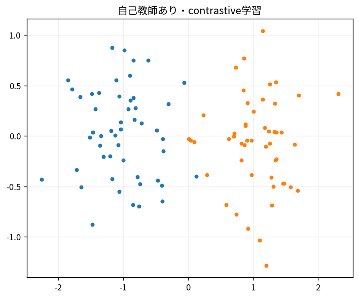

# 自己教師あり・contrastive学習

Course 09｜深層学習｜Topic 14/20

---
layout: center
---

## 今回の問い

## 到達目標

- 定義と代表式を、自分の言葉と記号で説明できる。
- 成立条件を確認し、手計算と結果を検算できる。

## 理解確認

- 定義・条件・計算結果を自分の言葉で説明できるか確認する。

自己教師あり・contrastive学習の代表式は、どの定義・仮定から、なぜその形になるのか。

---

## なぜ今これを学ぶのか

前Topic `dl-diffusion-score-models` で得た概念を使い、ここでは 自己教師あり・contrastive学習 へ進む。

---

## 直感

contrastive学習は正例pairを近づけ、負例を遠ざけることでラベルなしに表現空間を整える。

---

## 図解

embedding平面でpositive pairが集まりnegativeが離れる様子を見る。 同じ対象の2 viewを近づけ、異なる対象を遠ざける。埋め込み空間の距離/角度がsemantic similarityを表すようにlossを設計する。

---

## 記号と代表式

- $z,z^+$：positive pair embeddings
- $z_j$：negatives
- $s$：similarity
- $\tau$：temperature

$$
\mathcal{L}_{\mathrm{InfoNCE}}=-\log\frac{e^{s(z,z^+)/\tau}}{\sum_j e^{s(z,z_j)/\tau}}
$$

---

## 導出 1

$s(z,z_j)/τ$ をcandidate logitsとみなす。

---

## 導出 2

positive j=+ のsoftmax probabilityを高めるnegative log likelihoodがInfoNCE。

---

## 例題

同imageのcrop/color augmentをpositive、other imagesをnegative。

---

## 条件を変えるとどうなるか

augmentationがsemantic labelを壊すと「同じにすべきでない」pairを近づける。

---

## よくある誤解

自己教師あり・contrastive学習では、式へ数値を代入するだけでは不十分である。augmentationがsemantic labelを壊すと「同じにすべきでない」pairを近づける。 という失敗例が示すように、式を使える条件と結論の範囲を区別する必要がある。

---

## 実装・計算上の注意

embedding normalization、batch size/negative queue、distributed all-gather semantics。

---

## 一段先へ

learned discrete/continuous representationsをembedding matrixとして整理する。

---

## 自分で説明できるか

- 「logits」を式を見ずに説明できるか
- 「temperature」までの論理を一段ずつ再現できるか
- 自己教師あり・contrastive学習の条件を1つ外した反例を説明できるか

---
layout: center
---

## 教科書と演習

- [教科書](../../textbook/dl-self-supervised-contrastive)
- [10問の演習](../../exercises/dl-self-supervised-contrastive)
