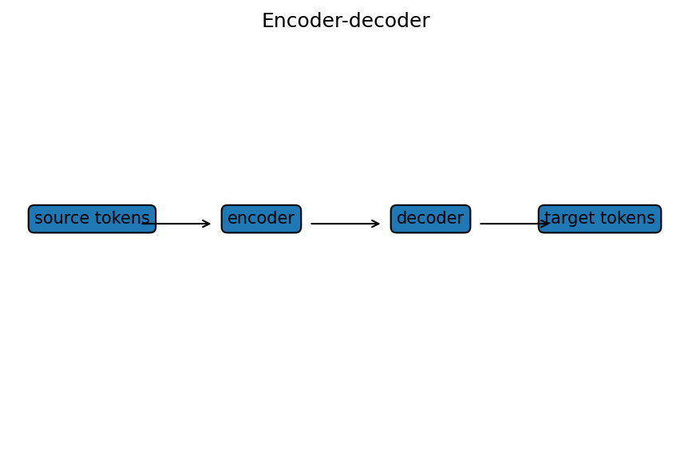

# seq2seq・encoder-decoder・teacher forcing

Course 09｜深層学習

---

## 何を解決するか

入力長と出力長が異なる系列変換を、encoderとdecoderへ分けてどう学習するか。

encoderは入力系列を表現へ変換し、decoderは過去token条件付きで次token分布を生成する。teacher forcingでは訓練時に正解prefixを与える。

---

## 図の意味

左側の複数入力token $x_1,\dots,x_m$ がencoderへ入り、context/encoder statesがdecoderへ渡る。右側では時刻tのdecoderが過去target prefix $y_{<t}$ とencoder情報から $y_t$ の分布を出す。training時のteacher forcing矢印は、前時刻のmodel予測ではなく正解tokenを次step入力に使うことを表す。

---

## 記号

| 記号 | 意味 |
|---|---|
| $x_{1:m}$ | 入力系列 |
| $y_{1:n}$ | 出力系列 |
| $p_θ(y_t|y_{<t},x)$ | 次token分布 |

- $x=x_{1:m}$：入力token列。
- $y=y_{1:n}$：target出力列。
- $y_{<t}$：時刻tより前のtarget prefix。
- $\pi_\theta$：decoderの条件付きtoken分布。

---

## 中心式

$$
\mathcal L=-\sum_{t=1}^n\log p_\theta(y_t\mid y_{<t},x)
$$

---

## 導出

1. chain rule of probabilityで $p(y|x)=∏_t p(y_t|y_{<t},x)$。
2. negative logを取ると和になりtoken-level cross entropyになる。
3. teacher forcingは各条件 $y_{<t}$ にground-truth prefixを使う。

---

## 省略しない一段

conditional sequence probabilityは確率のchain ruleで $p(y_{1:n}|x)=\prod_{t=1}^n p(y_t|y_{<t},x)$。maximum likelihoodはこの積を最大化し、logを取れば和、negative logならtoken cross entropyになる。

teacher forcingではtraining時に条件prefixとしてground truthを使えるので各token lossを並列/安定に計算しやすい。一方inferenceでは自分の過去predictionを条件にするためdistribution mismatch（exposure bias）が生じる。

---

## 手計算

**問題**：target token列が2 tokenで、正解token確率が順に0.9,0.4のときteacher-forcing NLLを求めよ。

**解答**：$\mathcal L=-\log0.9-\log0.4\approx0.10536+0.91629=1.02165$。各時刻ではground-truth prefixを条件に確率を評価する。

---

## 条件を変える

targetが[A,B]でmodelが $p(A|x)=0.8$, $p(B|A,x)=0.5$ ならsequence likelihood=0.4、negative log likelihood=$-\log0.8-\log0.5\approx0.916$。

---

## どこで壊れるか

teacher forcingを「正解系列全体をdecoderが未来まで見てよい」と誤解しない。causal decoderでは時刻tは $y_{<t}$ だけを条件にし、未来targetはmaskする。

---

## 次へ

RNN encoder-decoderからattentionを導入すると固定長context bottleneckを緩和でき、Transformerではencoder/decoderのattention構造へ発展する。

---

[教科書](../../textbook/dl-seq2seq-teacher-forcing)　|　[10問の演習](../../exercises/dl-seq2seq-teacher-forcing)

---

## 今回の問い

「seq2seq・encoder-decoder・teacher forcing」は何を表し、どの条件で使え、結果をどう検算するのか？

---

## 到達目標

- 入力長と出力長が異なる系列変換を、encoderとdecoderへ分けてどう学習するか。
- 中心式の記号と成立条件を説明できる
- 小さい例と反例で検算できる

---

## 理解確認

1. 入力長と出力長が異なる系列変換を、encoderとdecoderへ分けてどう学習するか。
2. 中心式の記号と成立条件を説明できる
3. 小さい例と反例で検算できる
