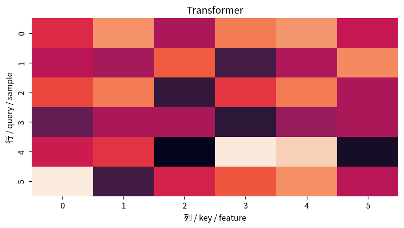

# Transformer

Course 09｜深層学習｜Topic 09/20

---
layout: center
---

## 今回の問い

## 到達目標

- 定義と代表式を、自分の言葉と記号で説明できる。
- 成立条件を確認し、手計算と結果を検算できる。

## 理解確認

- 定義・条件・計算結果を自分の言葉で説明できるか確認する。

Transformerの代表式は、どの定義・仮定から、なぜその形になるのか。

---

## なぜ今これを学ぶのか

前Topic `dl-attention-mechanism` で得た概念を使い、ここでは Transformer へ進む。

---

## 直感

attentionはqueryとkeyの類似度から重みを作り、valueの加重平均で必要な情報を取り出す。

---

## 図解

attention matrixのheatmapで各tokenがどこを見るか可視化する。 行がquery、列がkey、セルがsoftmax後のattention weightである。各行の重み付き和でvalueを混ぜるため、queryごとに参照先が変わる。

---

## 記号と代表式

- $H\in\mathbb R^{T\times d}$：token states
- $MHA(H)$：multi-head self-attention
- $FFN$：position-wise MLP
- $LN$：LayerNorm

$$
\mathbf{H}^{\prime}=\operatorname{LN}(\mathbf{H}+\operatorname{MHA}(\mathbf{H}))
$$

---

## 導出 1

各headでdifferent Q,K,V projectionsを作りattention、head outputsをconcat+linear projection。

---

## 導出 2

$H\leftarrow H+MHA(H)$、then $H\leftarrow H+FFN(H)$（pre/post-LN variant）。identity pathでinformation/gradientを運ぶ。

---

## 例題

one headはlocal syntactic relation、anotherはlong-range dependencyなどdifferent subspacesを学習し得る。

---

## 条件を変えるとどうなるか

「Transformer=attentionだけ」ではない。FFN, residual, normalization, positional informationがblockの重要要素。

---

## よくある誤解

Transformerでは、式へ数値を代入するだけでは不十分である。「Transformer=attentionだけ」ではない。FFN, residual, normalization, positional informationがblockの重要要素。 という失敗例が示すように、式を使える条件と結論の範囲を区別する必要がある。

---

## 実装・計算上の注意

pre-LN/post-LN、RoPE、GQA等variantで式が変わる。model configを明示。

---

## 一段先へ

residual/normalizationがなぜvery deep networkのoptimizationを支えるか次Topicで分離して見る。

---

## 自分で説明できるか

- 「multi-head」を式を見ずに説明できるか
- 「position」までの論理を一段ずつ再現できるか
- Transformerの条件を1つ外した反例を説明できるか

---
layout: center
---

## 教科書と演習

- [教科書](../../textbook/dl-transformers)
- [10問の演習](../../exercises/dl-transformers)
