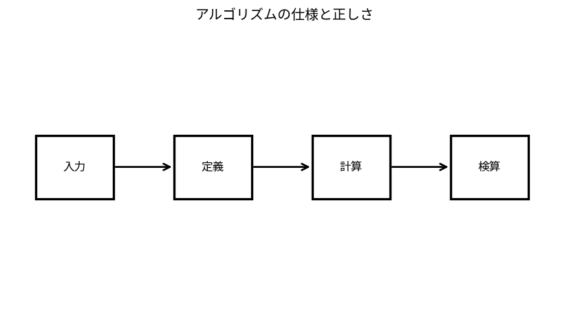

# アルゴリズムの仕様と正しさ

Course 04｜離散数学

---
layout: center
---

## 今回の問い

アルゴリズムの仕様と正しさで、何を入力し、代表式がどの量を出力し、どの成立条件を外すと結果が壊れるのか。

---

## 到達目標

- アルゴリズムの仕様と正しさの定義と代表式を言葉で説明できる
- 図と式の対応を説明できる
- 小さな例で成立条件と失敗条件を検算できる

---

## 直感

アルゴリズムの正しさは「停止すること」と「停止時に仕様を満たすこと」の両方で示す。

**前提:** dm-proof-methods, prep-python-expressions-functions

---

## 図解

---

## 図を見るポイント

- 図の軸・点・矢印・領域を数式と対応づける
- 代表式の各項と図の要素を対応づける
- 条件を変えたとき、どこが変化するか予測する

---

## 代表式

$$
\{P\}\ C\ \{Q\}
$$

左辺の出力 → 右辺の操作 → 入力の型の順で読む。

---

## 式をどう読むか

- **対象:** アルゴリズムの仕様、正しさ
- shape・次元・定義域を先に確定する
- 計算後に符号・大きさ・残差・確率などを図と照合する

---

## 小さな例

ループの各反復で不変量が保たれる様子を状態遷移として描く。

小さな例で、手計算と実装の結果を照合する。

---

## 動き／思考実験で確認

- 静止図で条件を一つずつ変えたときの変化を追う。
- 図の形がどう変わるか予測してから次へ進む。

---

## 成立条件

- 実行例が通ることは一般的正しさの証明ではない。
- 停止性を別途確認する。
- アルゴリズムの仕様と正しさの定義と計算手順を区別し、数値例だけで一般性を判断しない。

---

## よくある誤解

- アルゴリズムの仕様と正しさの定義と計算手順を同一視する
- 成立条件を確認せず公式を適用する
- 数学上の次元と配列のshapeを混同する

---

## 数値・実装で検算

1. 小さい入力を作る
2. 定義式から期待値を手で求める
3. NumPy等の実装結果と比較する
4. shape・残差・許容誤差・seedを記録する

---

## 後続分野への接続

アルゴリズムの仕様と正しさは、後続の数値計算・データ解析・機械学習で前提となる。

このTopicの量が、後続で入力・目的関数・制約・診断のどれとして使われるか確認する。

---

## 理解確認

- アルゴリズムの仕様と正しさを図→式→小例の順で説明できるか
- 条件を1つ外した反例を作れるか

[教科書](../../textbook/dm-algorithm-specifications-correctness)

[10問の演習](../../exercises/dm-algorithm-specifications-correctness)
