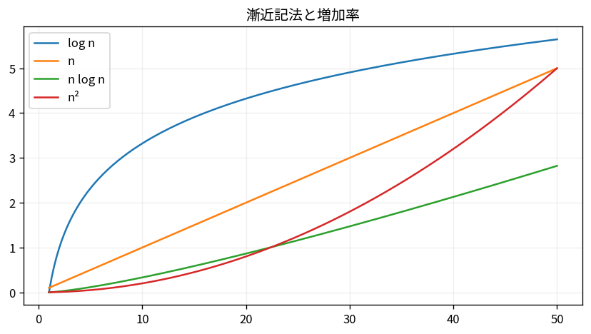

# 漸近記法と増加率

Course 04｜離散数学と証明｜Topic 13/20

---
layout: center
---

## 今回の問い

## 到達目標

- 定義と代表式を、自分の言葉と記号で説明できる。
- 成立条件を確認し、手計算と結果を検算できる。

## 理解確認

- 定義・条件・計算結果を自分の言葉で説明できるか確認する。

漸近記法と増加率の代表式は、どの定義・仮定から、なぜその形になるのか。

---

## なぜ今これを学ぶのか

前Topic `dm-loop-invariants-termination` で得た概念を使い、ここでは 漸近記法と増加率 へ進む。

---

## 直感

漸近解析は入力サイズnを大きくしたときの増加率を、定数倍や低次項を捨てて比較する。

---

## 図解

log n, n, n log n, n^2の曲線を同じ軸で比較する。 横軸を入力サイズn、縦軸を操作回数として、定数・対数・線形・n log n・二次の増え方を比較する。大きなnでは低次項や定数係数より成長次数が支配的になる。

---

## 記号と代表式

- $f(n)$：実際の計算量
- $g(n)$：比較基準
- $f(n)=O(g(n))$：十分大きいnで定数倍以内の上界
- $\Theta(g(n))$：上下から同じorder

$$
f(n)=O(g(n))
$$

---

## 導出 1

$3n^2+5n+7$ でn≥1なら5n≤5n²,7≤7n²なので全体≤15n²。よってO(n²)。

---

## 導出 2

同じ式は3n²以上なのでΩ(n²)も成立。両方からΘ(n²)。

---

## 例題

$1000n$ と $n^2$ は小さいnで前者が大きくても、n>1000でn²が上回る。漸近記法は定数を捨て大規模成長を比較する。

---

## 条件を変えるとどうなるか

$f=O(g)$ と $g=O(f)$ のどちらか一方だけでΘとは言えない。n=O(n²)だがn²=O(n)ではない。

---

## よくある誤解

漸近記法と増加率では、式へ数値を代入するだけでは不十分である。$f=O(g)$ と $g=O(f)$ のどちらか一方だけでΘとは言えない。n=O(n²)だがn²=O(n)ではない。 という失敗例が示すように、式を使える条件と結論の範囲を区別する必要がある。

---

## 実装・計算上の注意

benchmarkの実測時間はcache、constant、I/Oを含む。漸近解析と実測benchmarkを補完的に使う。

---

## 一段先へ

recursive algorithmの計算量はrecurrenceで表されることが多い。次Topicで漸化式を解く。

---

## 自分で説明できるか

- 「定数倍と低次項を吸収する」を式を見ずに説明できるか
- 「Big-Oは等号ではない」までの論理を一段ずつ再現できるか
- 漸近記法と増加率の条件を1つ外した反例を説明できるか

---
layout: center
---

## 教科書と演習

- [教科書](../../textbook/dm-asymptotic-notation-growth-rates)
- [10問の演習](../../exercises/dm-asymptotic-notation-growth-rates)
