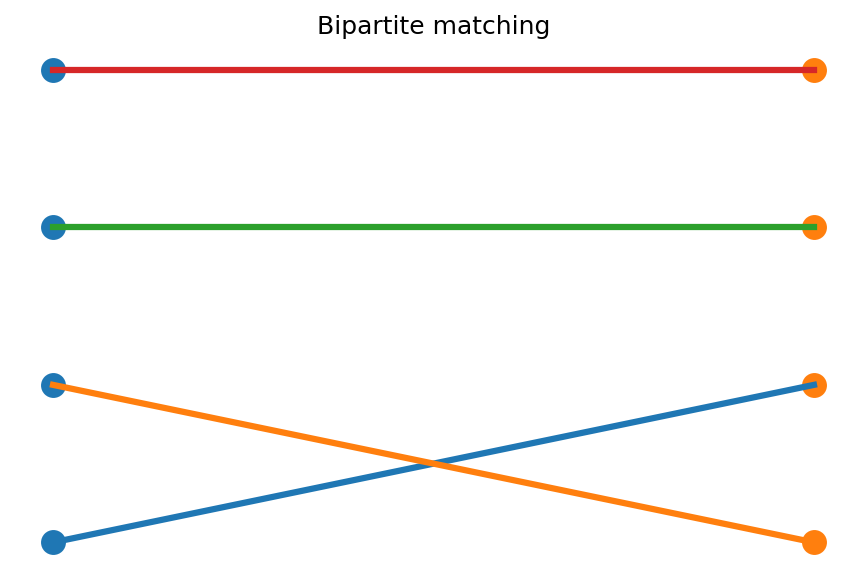

# 二部matchingとHallの定理

Course 04｜離散数学

---

## 今回の問い

左側の全頂点を重複なく右側へ割り当てられる条件は何か。

---

## 直感

matchingは端点を共有しない辺集合。Hallの条件は、左側のどんな部分集合を取っても候補となる右頂点が人数以上あることを要求する。

---

## 図解

---

## 中心式

$$
\exists\text{ matching saturating }L\iff \forall S\subseteq L:\ |N(S)|\ge|S|
$$

---

## 導出

1. 条件が必要なのは鳩の巣原理から直ちに分かる。
2. 十分性は最大matchingを仮定し、未matching頂点から交互道を探索する。
3. 増加路が無いとHall違反集合を構成でき、矛盾。

---

## 小さい例

3人に3種類の仕事を割り当てるとき、任意のk人が少なくともk種類の候補仕事を持つなら完全割当が存在する。

---

## 条件を外すと

- matchingとperfect matchingを区別する。
- 局所的に候補が多いだけでHall条件全体を満たすとは限らない。

---

## 理解確認

- 式の各記号を定義できるか。
- 導出を1段ずつ再現できるか。
- 反例を1つ作れるか。

---

## 教科書と演習

[教科書](../../textbook/dm-bipartite-matching-hall)

[10問の演習](../../exercises/dm-bipartite-matching-hall)
