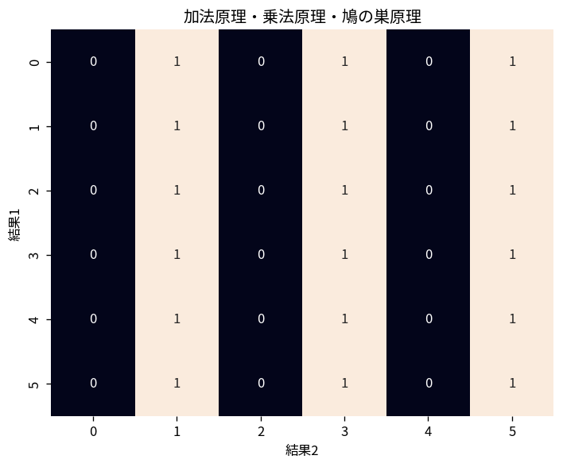

# 加法原理・乗法原理・鳩の巣原理

Course 04｜離散数学と証明｜Topic 08/20

---
layout: center
---

## 今回の問い

## 到達目標

- 定義と代表式を、自分の言葉と記号で説明できる。
- 成立条件を確認し、手計算と結果を検算できる。

## 理解確認

- 定義・条件・計算結果を自分の言葉で説明できるか確認する。

加法原理・乗法原理・鳩の巣原理の代表式は、どの定義・仮定から、なぜその形になるのか。

---

## なぜ今これを学ぶのか

前Topic `dm-divisibility-modular-arithmetic` で得た概念を使い、ここでは 加法原理・乗法原理・鳩の巣原理 へ進む。

---

## 直感

数え上げでは、順序を区別するか、重複を許すか、条件を満たすかを先に決める。

---

## 図解

小さな4要素集合から2要素を選ぶ全ケースを並べ、順列と組合せを比較する。 図中の各点・枝は1つの可能な選択を表す。順序を区別する経路と、同じ集合へ合流する経路を比較すると、順列で掛けた重複を組合せでは階乗で割る理由が見える。

---

## 記号と代表式

- $n$：対象数
- $m$：箱/分類数
- $\lceil n/m\rceil$：平均以上を保証する最小整数

$$
\left\lceil\frac{n}{m}\right\rceil
$$

---

## 導出 1

第1段階a通り、各場合で第2段階b通りなら順序対はa×b通り。

---

## 導出 2

全ての箱が $\lceil n/m\rceil-1$ 個以下と仮定すると総数は $m(\lceil n/m\rceil-1)<n$ となり矛盾。

---

## 例題

13人いれば誕生月12種類なので少なくとも同じ月の2人がいる。

---

## 条件を変えるとどうなるか

箱の分類が重複したり対象が複数箱へ入る設定では単純な鳩の巣原理をそのまま適用できない。

---

## よくある誤解

加法原理・乗法原理・鳩の巣原理では、式へ数値を代入するだけでは不十分である。箱の分類が重複したり対象が複数箱へ入る設定では単純な鳩の巣原理をそのまま適用できない。 という失敗例が示すように、式を使える条件と結論の範囲を区別する必要がある。

---

## 実装・計算上の注意

bucketizationやload balancingの下限証明に使える。最大loadの保証と期待値は異なるので確率的配置では別解析も必要。

---

## 一段先へ

より精密な数え上げには順列・組合せ・二項係数を使う。

---

## 自分で説明できるか

- 「乗法原理」を式を見ずに説明できるか
- 「存在保証と構成を区別する」までの論理を一段ずつ再現できるか
- 加法原理・乗法原理・鳩の巣原理の条件を1つ外した反例を説明できるか

---
layout: center
---

## 教科書と演習

- [教科書](../../textbook/dm-counting-principles-pigeonhole)
- [10問の演習](../../exercises/dm-counting-principles-pigeonhole)
