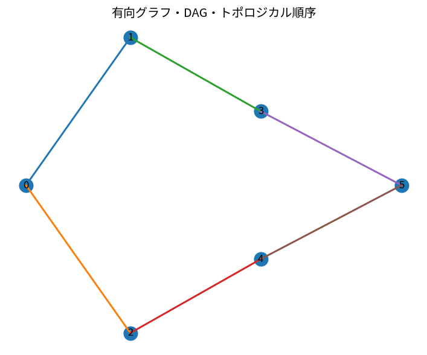

# 有向グラフ・DAG・トポロジカル順序

Course 04｜離散数学と証明｜Topic 19/20

---
layout: center
---

## 今回の問い

## 到達目標

- 定義と代表式を、自分の言葉と記号で説明できる。
- 成立条件を確認し、手計算と結果を検算できる。

## 理解確認

- 定義・条件・計算結果を自分の言葉で説明できるか確認する。

有向グラフ・DAG・トポロジカル順序の代表式は、どの定義・仮定から、なぜその形になるのか。

---

## なぜ今これを学ぶのか

前Topic `dm-trees-spanning-trees` で得た概念を使い、ここでは 有向グラフ・DAG・トポロジカル順序 へ進む。

---

## 直感

DAGでは辺の向きに矛盾しない線形順序を作れる。

---

## 図解

依存関係グラフを左から右へ並べ替え、トポロジカル順序を示す。 矢印の向きが依存関係を表す。閉じた有向cycleがないため、入次数0の頂点から順に取り除くと全頂点を依存順に並べられる。

---

## 記号と代表式

- $u\to v$：有向edge
- DAG：directed acyclic graph
- $\operatorname{order}(v)$：topological orderでの位置

$$
u\to v\Longrightarrow\operatorname{order}(u)<\operatorname{order}(v)
$$

---

## 導出 1

全vertexにincoming edgeがあると仮定し、incomingを遡り続けると有限vertexなのでどこかを再訪しcycleになる。矛盾。

---

## 導出 2

in-degree0 vertexを1つ除く。残りもDAGなので同じ操作を繰り返し、全edgeが前→後になる順序を構成できる。

---

## 例題

course prerequisite graphは「前提→後続」。DAGなら履修可能順をtopological sortで得る。

---

## 条件を変えるとどうなるか

cycle A→B→C→AがあるとA<B<C<Aを同時に満たす順序は存在しない。

---

## よくある誤解

有向グラフ・DAG・トポロジカル順序では、式へ数値を代入するだけでは不十分である。cycle A→B→C→AがあるとA<B<C<Aを同時に満たす順序は存在しない。 という失敗例が示すように、式を使える条件と結論の範囲を区別する必要がある。

---

## 実装・計算上の注意

build systemやtask schedulerで依存graphをDAGとして扱う。dynamic dependency追加時はcycle detectionが必要。

---

## 一段先へ

最後にindicator変数を使い、離散構造上のrandomized processを期待値で解析する。

---

## 自分で説明できるか

- 「DAGにはin-degree 0 vertexがある」を式を見ずに説明できるか
- 「逆方向」までの論理を一段ずつ再現できるか
- 有向グラフ・DAG・トポロジカル順序の条件を1つ外した反例を説明できるか

---
layout: center
---

## 教科書と演習

- [教科書](../../textbook/dm-directed-graphs-dags-topological-order)
- [10問の演習](../../exercises/dm-directed-graphs-dags-topological-order)
