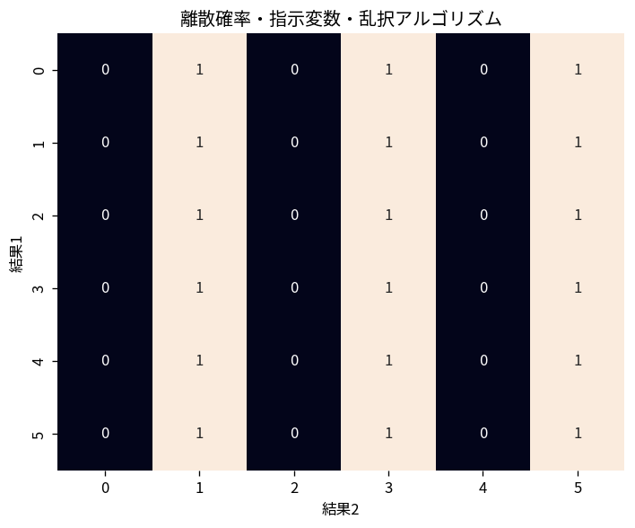

# 離散確率・指示変数・乱択アルゴリズム

Course 04｜離散数学と証明｜Topic 20/20

---
layout: center
---

## 今回の問い

## 到達目標

- 定義と代表式を、自分の言葉と記号で説明できる。
- 成立条件を確認し、手計算と結果を検算できる。

## 理解確認

- 定義・条件・計算結果を自分の言葉で説明できるか確認する。

離散確率・指示変数・乱択アルゴリズムの代表式は、どの定義・仮定から、なぜその形になるのか。

---

## なぜ今これを学ぶのか

前Topic `dm-directed-graphs-dags-topological-order` で得た概念を使い、ここでは 離散確率・指示変数・乱択アルゴリズム へ進む。

---

## 直感

確率は事象へ0〜1の重みを与え、和・積・補集合の規則で複雑な事象を組み立てる。

---

## 図解

2個のサイコロの標本空間を格子で描き、事象をセル集合として見る。 格子の1セルが1つの基本結果、色付き領域が事象である。和事象は領域の和集合、積事象は共通部分、補事象は標本空間からその領域を除いた部分に対応する。

---

## 記号と代表式

- $I_A$：事象Aなら1、そうでなければ0のindicator
- $E[I_A]=P(A)$
- $X=\sum_i I_i$：数えたい個数

$$
\mathbb{E}[I_A]=\mathbb{P}(A)
$$

---

## 導出 1

$E[I_A]=1·P(A)+0·P(A^c)=P(A)$。

---

## 導出 2

条件を満たす対象数Xは、各対象iが条件を満たすindicatorの和 $X=\sum I_i$。

---

## 例題

ランダム順列のfixed point数。各位置iが固定される確率1/nなので、期待fixed pointsはn·(1/n)=1。事象は独立でなくてもよい。

---

## 条件を変えるとどうなるか

期待値が1だから必ず1個起こるわけではない。fixed point数は0,1,2,…を取り得る。expectationは長期平均。

---

## よくある誤解

離散確率・指示変数・乱択アルゴリズムでは、式へ数値を代入するだけでは不十分である。期待値が1だから必ず1個起こるわけではない。fixed point数は0,1,2,…を取り得る。expectationは長期平均。 という失敗例が示すように、式を使える条件と結論の範囲を区別する必要がある。

---

## 実装・計算上の注意

randomized algorithm評価ではseed固定の1 runで期待性能を判断せず、多数runと理論期待値を比較する。

---

## 一段先へ

indicatorとlinearity of expectationはhashing、randomized quicksort、concentration inequalitiesの基礎。Course08のrandomized ML評価にも再登場する。

---

## 自分で説明できるか

- 「indicatorの期待値」を式を見ずに説明できるか
- 「期待値の線形性」までの論理を一段ずつ再現できるか
- 離散確率・指示変数・乱択アルゴリズムの条件を1つ外した反例を説明できるか

---
layout: center
---

## 教科書と演習

- [教科書](../../textbook/dm-discrete-probability-indicators-randomized-algorithms)
- [10問の演習](../../exercises/dm-discrete-probability-indicators-randomized-algorithms)
