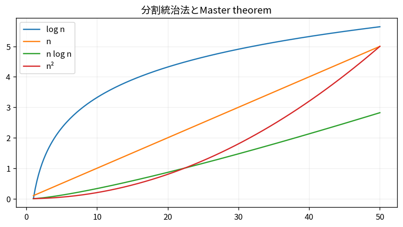

# 分割統治法とMaster theorem

Course 04｜離散数学と証明｜Topic 15/20

---
layout: center
---

## 今回の問い

## 到達目標

- 定義と代表式を、自分の言葉と記号で説明できる。
- 成立条件を確認し、手計算と結果を検算できる。

## 理解確認

- 定義・条件・計算結果を自分の言葉で説明できるか確認する。

分割統治法とMaster theoremの代表式は、どの定義・仮定から、なぜその形になるのか。

---

## なぜ今これを学ぶのか

前Topic `dm-recurrence-relations` で得た概念を使い、ここでは 分割統治法とMaster theorem へ進む。

---

## 直感

漸近解析は入力サイズnを大きくしたときの増加率を、定数倍や低次項を捨てて比較する。

---

## 図解

log n, n, n log n, n^2の曲線を同じ軸で比較する。 横軸を入力サイズn、縦軸を操作回数として、定数・対数・線形・n log n・二次の増え方を比較する。大きなnでは低次項や定数係数より成長次数が支配的になる。

---

## 記号と代表式

- $a$：subproblem数
- $n/b$：各subproblem size
- $f(n)$：分割・結合の追加cost
- $n^{\log_b a}$：leaf側の基準成長

$$
T(n)=aT(n/b)+f(n)
$$

---

## 導出 1

node数はa^k、各sizeはn/b^k。leaf depthは $\log_b n$。

---

## 導出 2

最下層node数は $a^{\log_b n}=n^{\log_b a}$。これが再帰部分の自然な基準。

---

## 例題

Merge sort: a=2,b=2,f(n)=n。基準 $n^{\log_2 2}=n$ と同じなのでΘ(n log n)。

---

## 条件を変えるとどうなるか

Master theoremは任意のrecurrenceに使えない。subproblem sizeが不均等、aやbが変動、fがregularity条件を破る場合は再帰木やAkra–Bazzi等が必要。

---

## よくある誤解

分割統治法とMaster theoremでは、式へ数値を代入するだけでは不十分である。Master theoremは任意のrecurrenceに使えない。subproblem sizeが不均等、aやbが変動、fがregularity条件を破る場合は再帰木やAkra–Bazzi等が必要。 という失敗例が示すように、式を使える条件と結論の範囲を区別する必要がある。

---

## 実装・計算上の注意

実際のdivide-and-conquerではcopy costやcache localityがf(n)へ入る。漸近orderが同じ実装でも定数差が大きい。

---

## 一段先へ

計算量解析の道具を得たので、次はgraphという離散構造の基本量へ進む。

---

## 自分で説明できるか

- 「再帰木のlevel k」を式を見ずに説明できるか
- 「f(n)との比較」までの論理を一段ずつ再現できるか
- 分割統治法とMaster theoremの条件を1つ外した反例を説明できるか

---
layout: center
---

## 教科書と演習

- [教科書](../../textbook/dm-divide-conquer-master-theorem)
- [10問の演習](../../exercises/dm-divide-conquer-master-theorem)
