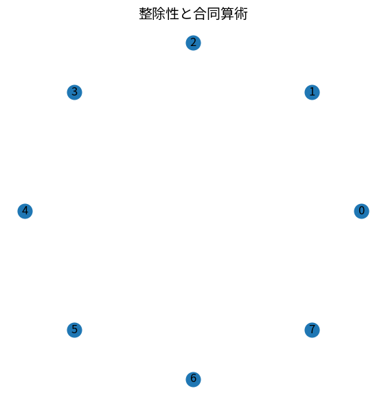

# 整除性と合同算術

Course 04｜離散数学と証明｜Topic 07/20

---
layout: center
---

## 今回の問い

## 到達目標

- 定義と代表式を、自分の言葉と記号で説明できる。
- 成立条件を確認し、手計算と結果を検算できる。

## 理解確認

- 定義・条件・計算結果を自分の言葉で説明できるか確認する。

整除性と合同算術の代表式は、どの定義・仮定から、なぜその形になるのか。

---

## なぜ今これを学ぶのか

前Topic `dm-relations-equivalence-partial-orders` で得た概念を使い、ここでは 整除性と合同算術 へ進む。

---

## 直感

合同算術は整数を法mで同じ余りのクラスへまとめる。

---

## 図解

時計状の円に整数を配置し、同じ剰余類へ重なる様子を見る。 数直線上で法mだけ離れた整数を同じ剰余類へまとめると、無限個の整数がm個のクラスへ折り畳まれる。加法・乗法がこのクラス上でも矛盾なく定義できる理由につながる。

---

## 記号と代表式

- $a\mid b$：ある整数kでb=ak
- $a\equiv b\pmod m$：mがa-bを割り切る
- $[a]_m$：aの剰余類

$$
a\equiv b\pmod m\Longleftrightarrow m\mid(a-b)
$$

---

## 導出 1

$a=q_am+r$, $b=q_bm+r$ なら $a-b=(q_a-q_b)m$。よってm|(a-b)。逆も同様。

---

## 導出 2

a≡b, c≡dならa-b=km, c-d=lm。$(a+c)-(b+d)=(k+l)m$ なので a+c≡b+d。

---

## 例題

$17\equiv2\pmod5$、$13\equiv3\pmod5$ なので積は $17·13\equiv2·3=6\equiv1\pmod5$。

---

## 条件を変えるとどうなるか

合同式で通常の割り算は無条件にできない。$2x\equiv2\pmod6$ を2で割って $x\equiv1\pmod6$ とすると、x=4も元式を満たすのに失う。逆元条件が必要。

---

## よくある誤解

整除性と合同算術では、式へ数値を代入するだけでは不十分である。合同式で通常の割り算は無条件にできない。$2x\equiv2\pmod6$ を2で割って $x\equiv1\pmod6$ とすると、x=4も元式を満たすのに失う。逆元条件が必要。 という失敗例が示すように、式を使える条件と結論の範囲を区別する必要がある。

---

## 実装・計算上の注意

hashing、ring buffer、暗号でmod演算を使う。言語によって負数のremainder規則が異なるので数学的modと確認する。

---

## 一段先へ

modular inverseとEuclidean algorithmへ進むと線形合同式やRSAの基礎へつながるが、ここでは演算保存と剰余類を固定する。

---

## 自分で説明できるか

- 「余りが同じなら差はmの倍数」を式を見ずに説明できるか
- 「乗法も保存する」までの論理を一段ずつ再現できるか
- 整除性と合同算術の条件を1つ外した反例を説明できるか

---
layout: center
---

## 教科書と演習

- [教科書](../../textbook/dm-divisibility-modular-arithmetic)
- [10問の演習](../../exercises/dm-divisibility-modular-arithmetic)
