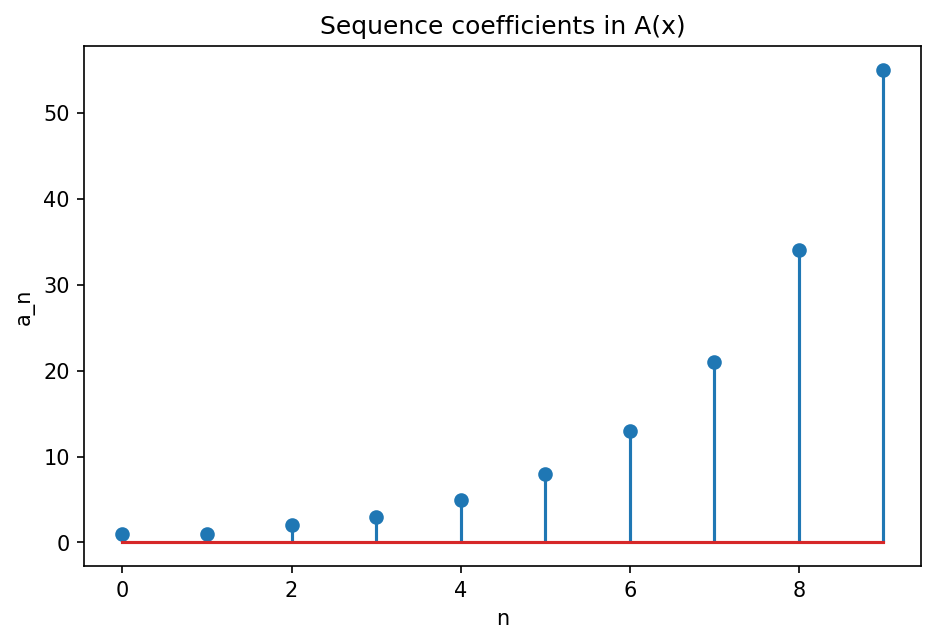

# 母関数

Course 04｜離散数学

---

## 何を解決するか

数列全体を1本の形式的な級数へ埋め込むと、漸化式がなぜ代数計算へ変わるのか。

母関数 A(x)=Σa_nx^n は、係数に数列を保存した形式的power series。index shiftがxの掛け算へ変換されるため、漸化式を方程式として解ける。

---

## 図の意味

棒グラフの第n本の高さが数列係数 $a_n$。母関数 $A(x)=a_0+a_1x+a_2x^2+\cdots$ は、この係数列を1つの形式的級数へ格納する。xを掛けると棒のindexが1つ右へずれるため、漸化式のshiftが代数的な掛け算へ変わる。

---

## 記号

| 記号 | 意味 |
|---|---|
| $a_n$ | 数列 |
| $A(x)$ | 通常母関数 |
| $[x^n]A(x)$ | x^nの係数 |

- $a_n$：数列係数。
- $A(x)=\sum_{n\ge0}a_nx^n$：ordinary generating function。
- x：係数shiftを記録する形式変数。

---

## 中心式

$$
A(x)=\sum_{n\ge0}a_nx^n
$$

---

## 導出

1. 漸化式の両辺にx^nを掛けてnについて足す。
2. a_{n-1}のshiftはxA(x)として表せる。
3. A(x)の代数方程式を解き、部分分数等で係数を読み戻す。

---

## 省略しない一段

母関数では解析的収束より「係数を操作する形式的冪級数」として扱うことが多い。$A(x)=\sum_{n\ge0}a_nx^n$ にxを掛けると $xA=\sum_{n\ge1}a_{n-1}x^n$。index shiftが明示的に表せる。

例えばFibonacci $F_n=F_{n-1}+F_{n-2}$ に対し、n≥2で両辺へ $x^n$ を掛けて和を取り、初期項を分離すると $F(x)-x=xF(x)+x^2F(x)$。したがって $F(x)=x/(1-x-x^2)$。ここから部分分数で閉形式も得られる。

---

## 手計算

**問題**：漸化式 $a_n=a_{n-1}+1$ ($n\ge1$), $a_0=0$ の母関数を求め、係数から $a_n$ を復元せよ。

**解答**：$A=\sum_{n\ge0}a_nx^n$。$A=xA+\sum_{n\ge1}x^n=xA+x/(1-x)$。よって $A=x/(1-x)^2$。$1/(1-x)^2=\sum_{n\ge0}(n+1)x^n$ なので $A=\sum_{n\ge1}n x^n$、ゆえに $a_n=n$。

---

## 条件を変える

$a_n=2a_{n-1}$, $a_0=1$ なら $A-1=2xA$、よって $A=1/(1-2x)=\sum(2x)^n$。係数比較から $a_n=2^n$。

---

## どこで壊れるか

形式的母関数で係数操作をしている段階と、実数xへ代入して解析関数として扱う段階を混同しない。収束半径を必要とする議論では別途確認する。

---

## 次へ

組合せ数え上げ、確率母関数、z-transform、漸化式解析へ広がる。Course 05の差分方程式・signal processingとも接続する。

---

[教科書](../../textbook/dm-generating-functions)　|　[10問の演習](../../exercises/dm-generating-functions)

---

## 今回の問い

「母関数」は何を表し、どの条件で使え、結果をどう検算するのか？

---

## 到達目標

- 数列全体を1本の形式的な級数へ埋め込むと、漸化式がなぜ代数計算へ変わるのか。
- 中心式の記号と成立条件を説明できる
- 小さい例と反例で検算できる

---

## 理解確認

1. 数列全体を1本の形式的な級数へ埋め込むと、漸化式がなぜ代数計算へ変わるのか。
2. 中心式の記号と成立条件を説明できる
3. 小さい例と反例で検算できる
