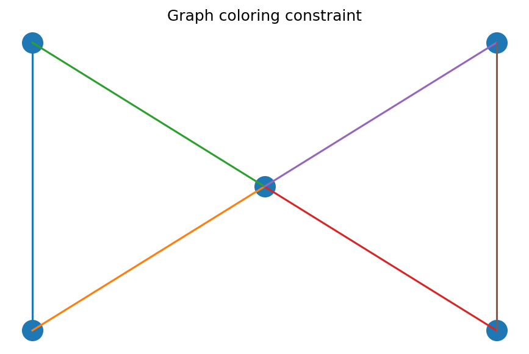

# グラフ彩色

Course 04｜離散数学

---

## 今回の問い

隣接頂点が同じ色を持たないようにする最小色数は、グラフ構造とどう関係するか。

---

## 直感

彩色は「衝突する対象を異なる資源へ割り当てる」問題。時間割、register allocation、周波数割当などへ直結する。

---

## 図解

---

## 中心式

$$
(u,v)\in E\Rightarrow c(u)\ne c(v)
$$

---

## 導出

1. 色は頂点へのlabel付与。
2. 全ての辺で両端のlabelが異なることをfeasibility条件にする。
3. その条件を満たす最小kをχ(G)と定義する。

---

## 小さい例

完全グラフK3は3色必要。二部グラフで辺があるなら2色で彩色可能。

---

## 条件を外すと

- greedy coloringの使用色数が必ずχ(G)とは限らない。
- 頂点彩色と辺彩色を混同しない。

---

## 理解確認

- 式の各記号を定義できるか。
- 導出を1段ずつ再現できるか。
- 反例を1つ作れるか。

---

## 教科書と演習

[教科書](../../textbook/dm-graph-coloring)

[10問の演習](../../exercises/dm-graph-coloring)
