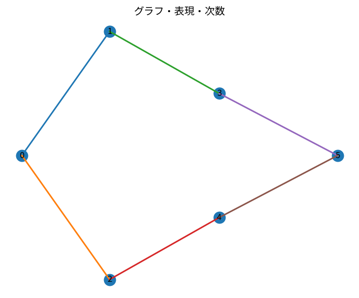

# グラフ・表現・次数

Course 04｜離散数学と証明｜Topic 16/20

---
layout: center
---

## 今回の問い

## 到達目標

- 定義と代表式を、自分の言葉と記号で説明できる。
- 成立条件を確認し、手計算と結果を検算できる。

## 理解確認

- 定義・条件・計算結果を自分の言葉で説明できるか確認する。

グラフ・表現・次数の代表式は、どの定義・仮定から、なぜその形になるのか。

---

## なぜ今これを学ぶのか

前Topic `dm-divide-conquer-master-theorem` で得た概念を使い、ここでは グラフ・表現・次数 へ進む。

---

## 直感

グラフは頂点と辺で関係を表し、道・連結性・次数は局所と大域の構造をつなぐ。

---

## 図解

小さなグラフで次数、最短路、連結成分を色分けする。 頂点が対象、辺が対象間の関係である。pathは隣接辺を順にたどる列、cycleは始点へ戻るpathであり、連結性や到達可能性を図上で直接確認できる。

---

## 記号と代表式

- $G=(V,E)$：graph
- $V$：vertex集合
- $E$：edge集合
- $\deg(v)$：vertex vに接続するedge数
- $\mathbf A$：隣接行列

$$
\sum_{v\in V}\deg(v)=2|E|
$$

---

## 導出 1

各vertexについて接続edgeをdegreeだけ数えると、vertex-edge incidenceの総数はdegreeの和。

---

## 導出 2

無向edgeは両端2vertexを持つので各edgeがincidenceを2つ作る。総数2|E|。

---

## 例題

三角形graphは各degree2、和6。edge3本なので2|E|=6。

---

## 条件を変えるとどうなるか

有向graphではin-degreeとout-degreeを区別する。無向のdegree公式をそのまま「各edgeがdegreeを2増やす」と読むと向きを失う。

---

## よくある誤解

グラフ・表現・次数では、式へ数値を代入するだけでは不十分である。有向graphではin-degreeとout-degreeを区別する。無向のdegree公式をそのまま「各edgeがdegreeを2増やす」と読むと向きを失う。 という失敗例が示すように、式を使える条件と結論の範囲を区別する必要がある。

---

## 実装・計算上の注意

networkx等ではmulti-edge/self-loopのdegree conventionを確認する。self-loopは無向degreeに2寄与する定義が一般的。

---

## 一段先へ

degreeは局所量。次Topicではpathを通じたglobalな到達可能性・connectednessを扱う。

---

## 自分で説明できるか

- 「vertex側からincidenceを数える」を式を見ずに説明できるか
- 「二重数え上げで等置」までの論理を一段ずつ再現できるか
- グラフ・表現・次数の条件を1つ外した反例を説明できるか

---
layout: center
---

## 教科書と演習

- [教科書](../../textbook/dm-graphs-representations-degrees)
- [10問の演習](../../exercises/dm-graphs-representations-degrees)
