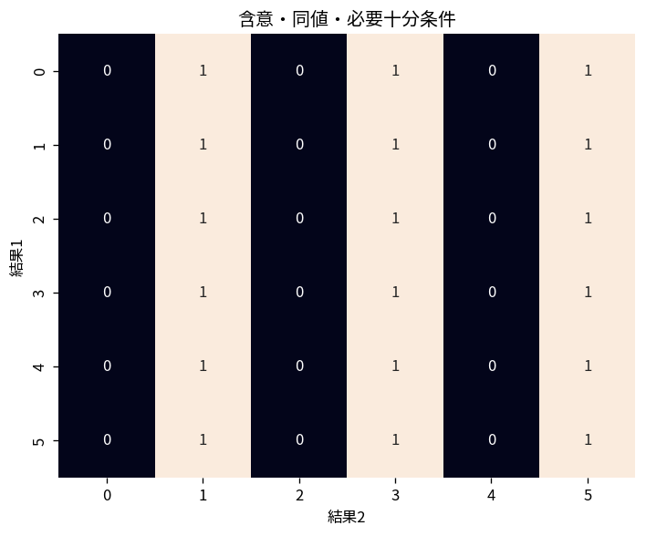

# 含意・同値・必要十分条件

Course 04｜離散数学と証明｜Topic 03/20

---
layout: center
---

## 今回の問い

## 到達目標

- 定義と代表式を、自分の言葉と記号で説明できる。
- 成立条件を確認し、手計算と結果を検算できる。

## 理解確認

- 定義・条件・計算結果を自分の言葉で説明できるか確認する。

含意・同値・必要十分条件の代表式は、どの定義・仮定から、なぜその形になるのか。

---

## なぜ今これを学ぶのか

前Topic `dm-predicates-quantifiers-negation` で得た概念を使い、ここでは 含意・同値・必要十分条件 へ進む。

---

## 直感

論理式は真偽値を入力として別の真偽値を返す関数として扱える。

---

## 図解

2命題P,Qの全4ケースを真理値表で列挙する。 行は命題変数の全ての真偽割当てである。列を左から計算すると、複合命題が全割当てで真か、ある割当てで偽かを機械的に判定できる。

---

## 記号と代表式

- $P\Rightarrow Q$：PはQの十分条件、QはPの必要条件
- $P\Leftrightarrow Q$：両方向の含意が成立する同値

$$
P\Longleftrightarrow Q
$$

---

## 導出 1

Pが真なら必ずQなので、Pが成立すればQを保証できる。この意味でPはQに十分。

---

## 導出 2

Pが成立するにはQが欠けてはいけない。$P\Rightarrow Q$ なのでQはPの必要条件。

---

## 例題

整数nが4の倍数なら2の倍数。4の倍数は2の倍数であるための十分条件、2の倍数は4の倍数であるための必要条件。逆は偽。

---

## 条件を変えるとどうなるか

必要条件を十分条件として使う誤り。試験合格に「受験すること」が必要でも、受験しただけで合格は保証されない。

---

## よくある誤解

含意・同値・必要十分条件では、式へ数値を代入するだけでは不十分である。必要条件を十分条件として使う誤り。試験合格に「受験すること」が必要でも、受験しただけで合格は保証されない。 という失敗例が示すように、式を使える条件と結論の範囲を区別する必要がある。

---

## 実装・計算上の注意

API precondition/postconditionや型制約でも必要条件と十分条件を分ける。validationを通ることが正しさの十分条件か、単に必要条件かを明示する。

---

## 一段先へ

含意の向きが整理できると、直接証明・対偶・背理法のどれが同じ命題をどう変形して示すか理解できる。

---

## 自分で説明できるか

- 「十分条件の向き」を式を見ずに説明できるか
- 「必要十分条件」までの論理を一段ずつ再現できるか
- 含意・同値・必要十分条件の条件を1つ外した反例を説明できるか

---
layout: center
---

## 教科書と演習

- [教科書](../../textbook/dm-implication-equivalence-conditions)
- [10問の演習](../../exercises/dm-implication-equivalence-conditions)
