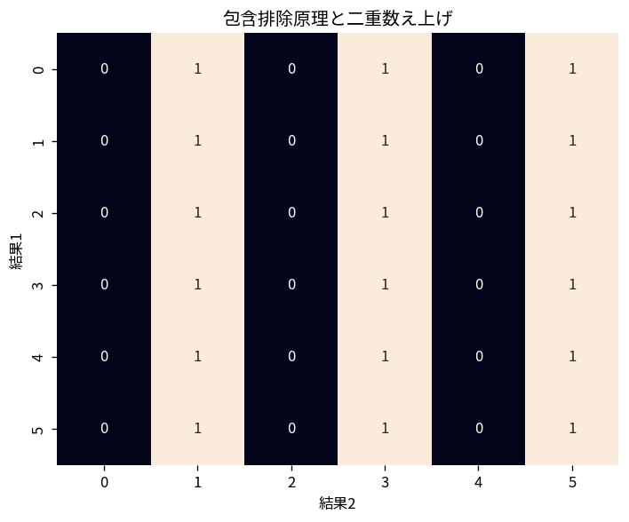

# 包含排除原理と二重数え上げ

Course 04｜離散数学と証明｜Topic 10/20

---
layout: center
---

## 今回の問い

## 到達目標

- 定義と代表式を、自分の言葉と記号で説明できる。
- 成立条件を確認し、手計算と結果を検算できる。

## 理解確認

- 定義・条件・計算結果を自分の言葉で説明できるか確認する。

包含排除原理と二重数え上げの代表式は、どの定義・仮定から、なぜその形になるのか。

---

## なぜ今これを学ぶのか

前Topic `dm-permutations-combinations-binomial` で得た概念を使い、ここでは 包含排除原理と二重数え上げ へ進む。

---

## 直感

数え上げでは、順序を区別するか、重複を許すか、条件を満たすかを先に決める。

---

## 図解

小さな4要素集合から2要素を選ぶ全ケースを並べ、順列と組合せを比較する。 図中の各点・枝は1つの可能な選択を表す。順序を区別する経路と、同じ集合へ合流する経路を比較すると、順列で掛けた重複を組合せでは階乗で割る理由が見える。

---

## 記号と代表式

- $|A|$：有限集合Aの要素数
- $A\cap B$：重複部分
- $A\cup B$：少なくとも一方

$$
|A\cup B|=|A|+|B|-|A\cap B|
$$

---

## 導出 1

$|A|+|B|$ では $A\cap B$ の要素を2回数えるため1回引き、$|A\cup B|=|A|+|B|-|A\cap B|$。

---

## 導出 2

単集合を足し、二重交わりを全て引くと三重交わりを3回引きすぎるため最後に1回足す。符号が交互になる。

---

## 例題

1〜100で2の倍数50個、3の倍数33個、両方=6の倍数16個。少なくとも一方は50+33-16=67個。

---

## 条件を変えるとどうなるか

重複を引いた後、三重重複の補正を忘れると3集合包含排除は誤る。

---

## よくある誤解

包含排除原理と二重数え上げでは、式へ数値を代入するだけでは不十分である。重複を引いた後、三重重複の補正を忘れると3集合包含排除は誤る。 という失敗例が示すように、式を使える条件と結論の範囲を区別する必要がある。

---

## 実装・計算上の注意

database queryのOR条件件数、feature flagsのcoverageなどで集合intersectionを明示して検算できる。

---

## 一段先へ

数え上げの構造は確率にもそのまま移る。Course03の包含排除公式はcardinalityをprobability measureへ置き換えた形。

---

## 自分で説明できるか

- 「二集合」を式を見ずに説明できるか
- 「二重数え上げ」までの論理を一段ずつ再現できるか
- 包含排除原理と二重数え上げの条件を1つ外した反例を説明できるか

---
layout: center
---

## 教科書と演習

- [教科書](../../textbook/dm-inclusion-exclusion-double-counting)
- [10問の演習](../../exercises/dm-inclusion-exclusion-double-counting)
