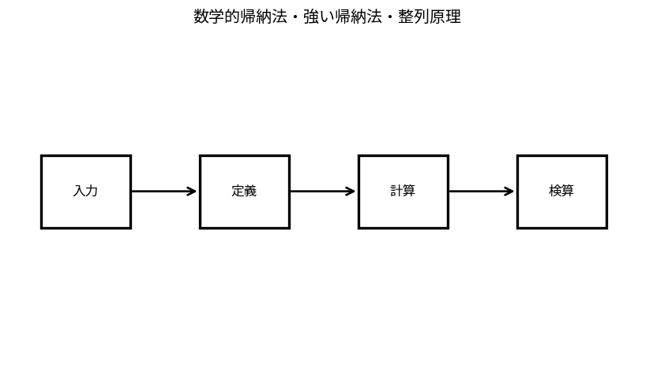

# 数学的帰納法・強い帰納法・整列原理

Course 04｜離散数学と証明｜Topic 05/20

---
layout: center
---

## 今回の問い

## 到達目標

- 定義と代表式を、自分の言葉と記号で説明できる。
- 成立条件を確認し、手計算と結果を検算できる。

## 理解確認

- 定義・条件・計算結果を自分の言葉で説明できるか確認する。

数学的帰納法・強い帰納法・整列原理の代表式は、どの定義・仮定から、なぜその形になるのか。

---

## なぜ今これを学ぶのか

前Topic `dm-proof-methods` で得た概念を使い、ここでは 数学的帰納法・強い帰納法・整列原理 へ進む。

---

## 直感

証明は結論が仮定から必ず従うことを、許された推論でつなぐ構造。

---

## 図解

命題→対偶→反例候補を図で分岐させ、どの証明法が合うか整理する。 矢印は仮定から結論へ進む論理の向きを表す。直接証明、対偶、背理法は結論自体を変えるのではなく、同値な論理形へ問題を組み替える方法である。

---

## 記号と代表式

- $P(n)$：自然数nに関する命題
- $n_0$：開始番号
- $P(k)\Rightarrow P(k+1)$：帰納step

$$
1+2+\cdots+n=\frac{n(n+1)}{2}
$$

---

## 導出 1

$P(n_0)$ が真でなければ帰納stepだけあってもどこからも始まらない。

---

## 導出 2

任意のkについて $P(k)\Rightarrow P(k+1)$ を示すと、baseからP(n0+1), P(n0+2)…と有限回適用できる。

---

## 例題

n=1で1=1·2/2。帰納stepを上記の通り示せば全nで和公式が成立。

---

## 条件を変えるとどうなるか

帰納仮定を「示したいP(k+1)も真」と置くのは循環。仮定してよいのはkまで。base caseを落とす誤りも典型。

---

## よくある誤解

数学的帰納法・強い帰納法・整列原理では、式へ数値を代入するだけでは不十分である。帰納仮定を「示したいP(k+1)も真」と置くのは循環。仮定してよいのはkまで。base caseを落とす誤りも典型。 という失敗例が示すように、式を使える条件と結論の範囲を区別する必要がある。

---

## 実装・計算上の注意

再帰algorithmの正しさ証明では入力サイズに対する帰納法を使う。recursive callがより小さい入力へ進むことがterminationにも関係する。

---

## 一段先へ

loop invariantは帰納法を時間stepへ適用したものと見ると理解しやすい。Course04後半でalgorithm correctnessへ接続する。

---

## 自分で説明できるか

- 「base caseで連鎖を開始する」を式を見ずに説明できるか
- 「和の公式を導く」までの論理を一段ずつ再現できるか
- 数学的帰納法・強い帰納法・整列原理の条件を1つ外した反例を説明できるか

---
layout: center
---

## 教科書と演習

- [教科書](../../textbook/dm-induction-well-ordering)
- [10問の演習](../../exercises/dm-induction-well-ordering)
