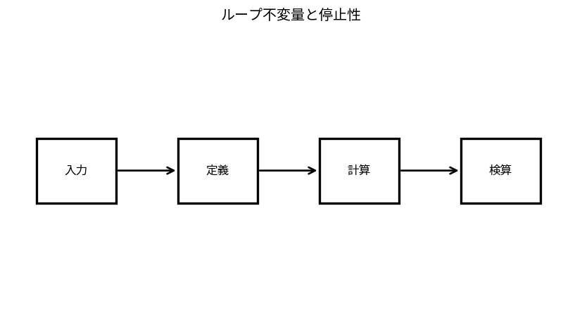

# ループ不変量と停止性

Course 04｜離散数学と証明｜Topic 12/20

---
layout: center
---

## 今回の問い

## 到達目標

- 定義と代表式を、自分の言葉と記号で説明できる。
- 成立条件を確認し、手計算と結果を検算できる。

## 理解確認

- 定義・条件・計算結果を自分の言葉で説明できるか確認する。

ループ不変量と停止性の代表式は、どの定義・仮定から、なぜその形になるのか。

---

## なぜ今これを学ぶのか

前Topic `dm-algorithm-specifications-correctness` で得た概念を使い、ここでは ループ不変量と停止性 へ進む。

---

## 直感

アルゴリズムの正しさは「停止すること」と「停止時に仕様を満たすこと」の両方で示す。

---

## 図解

ループの各反復で不変量が保たれる様子を状態遷移として描く。 各状態は反復の開始時点、矢印は1回の更新である。不変量は全ての状態で保たれる性質で、初期化・保持・終了の3段階が帰納法に対応する。

---

## 記号と代表式

- $I(k)$：k回反復後にも成り立つ不変条件
- $V$：各反復で減少するwell-foundedなvariant

$$
I(k)\Longrightarrow I(k+1)
$$

---

## 導出 1

loop開始時にIが成立することを示す。これは帰納法のbase case。

---

## 導出 2

Iとloop条件を仮定してbodyを1回実行した後もIを示す。これは帰納step。

---

## 例題

配列prefix sumでは「k回後、sは先頭k要素の和」がinvariant。終了時k=nなので全要素和。

---

## 条件を変えるとどうなるか

invariantが「loop終了後だけ真」でも不十分。各反復で保存されなければ帰納的に正しさを運べない。

---

## よくある誤解

ループ不変量と停止性では、式へ数値を代入するだけでは不十分である。invariantが「loop終了後だけ真」でも不十分。各反復で保存されなければ帰納的に正しさを運べない。 という失敗例が示すように、式を使える条件と結論の範囲を区別する必要がある。

---

## 実装・計算上の注意

debug assertionでinvariantを反復中に検査すると実装bugを見つけやすいが、有限testで数学的証明を置き換えない。

---

## 一段先へ

recursive algorithmでは入力sizeをvariantとして同様にterminationを証明できる。次に計算量を漸近記法で評価する。

---

## 自分で説明できるか

- 「初期化」を式を見ずに説明できるか
- 「終了時の結論」までの論理を一段ずつ再現できるか
- ループ不変量と停止性の条件を1つ外した反例を説明できるか

---
layout: center
---

## 教科書と演習

- [教科書](../../textbook/dm-loop-invariants-termination)
- [10問の演習](../../exercises/dm-loop-invariants-termination)
