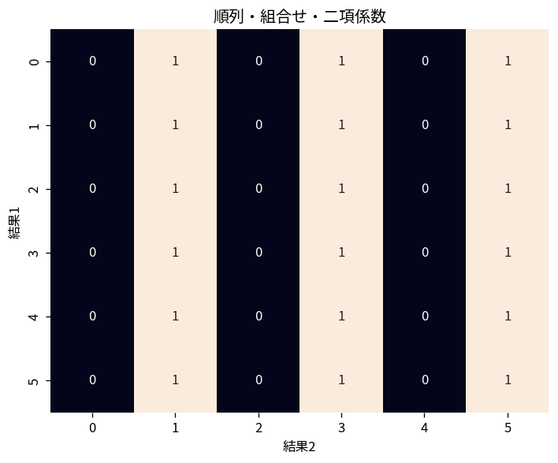

# 順列・組合せ・二項係数

Course 04｜離散数学と証明｜Topic 09/20

---
layout: center
---

## 今回の問い

## 到達目標

- 定義と代表式を、自分の言葉と記号で説明できる。
- 成立条件を確認し、手計算と結果を検算できる。

## 理解確認

- 定義・条件・計算結果を自分の言葉で説明できるか確認する。

順列・組合せ・二項係数の代表式は、どの定義・仮定から、なぜその形になるのか。

---

## なぜ今これを学ぶのか

前Topic `dm-counting-principles-pigeonhole` で得た概念を使い、ここでは 順列・組合せ・二項係数 へ進む。

---

## 直感

数え上げでは、順序を区別するか、重複を許すか、条件を満たすかを先に決める。

---

## 図解

小さな4要素集合から2要素を選ぶ全ケースを並べ、順列と組合せを比較する。 図中の各点・枝は1つの可能な選択を表す。順序を区別する経路と、同じ集合へ合流する経路を比較すると、順列で掛けた重複を組合せでは階乗で割る理由が見える。

---

## 記号と代表式

- $n!$：n個の全順列数
- $P(n,k)=n!/(n-k)!$：k個を順序付き選択
- $\binom nk$：順序なし選択

$$
(a+b)^n=\sum_{k=0}^{n}\binom{n}{k}a^{n-k}b^k
$$

---

## 導出 1

$(a+b)^n$ はn個の括弧から各回aかbを選ぶ全選択の和。

---

## 導出 2

$a^{n-k}b^k$ を作るにはn箇所のうちk箇所でbを選ぶ。選び方が $\binom nk$。

---

## 例題

5文字ABCDEから3文字を並べるなら5·4·3=60。集合として3文字選ぶだけなら60/3!=10。

---

## 条件を変えるとどうなるか

重複要素がある順列をn!とすると過大計数。AABの異なる並びは3!/2!=3。

---

## よくある誤解

順列・組合せ・二項係数では、式へ数値を代入するだけでは不十分である。重複要素がある順列をn!とすると過大計数。AABの異なる並びは3!/2!=3。 という失敗例が示すように、式を使える条件と結論の範囲を区別する必要がある。

---

## 実装・計算上の注意

大きいnのbinomialはfactorialを直接計算せず整数演算・log-gamma・漸化式を使う。

---

## 一段先へ

複数集合の重なりを数えるとき、単純加算の重複を補正する包含排除へ進む。

---

## 自分で説明できるか

- 「二項積を選択として読む」を式を見ずに説明できるか
- 「係数を得る」までの論理を一段ずつ再現できるか
- 順列・組合せ・二項係数の条件を1つ外した反例を説明できるか

---
layout: center
---

## 教科書と演習

- [教科書](../../textbook/dm-permutations-combinations-binomial)
- [10問の演習](../../exercises/dm-permutations-combinations-binomial)
