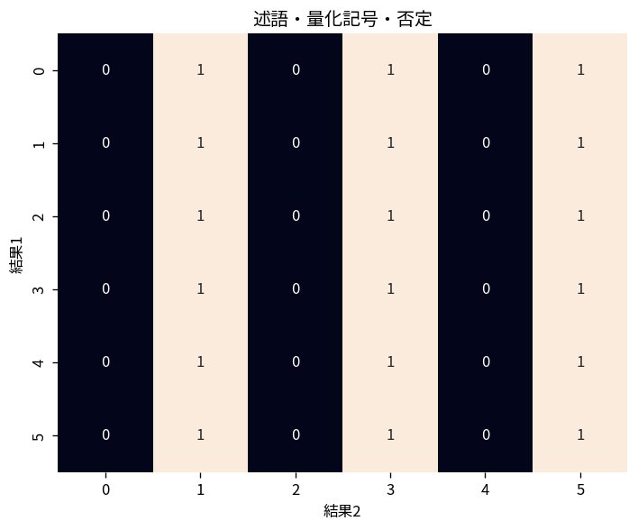

# 述語・量化記号・否定

Course 04｜離散数学と証明｜Topic 02/20

---
layout: center
---

## 今回の問い

## 到達目標

- 定義と代表式を、自分の言葉と記号で説明できる。
- 成立条件を確認し、手計算と結果を検算できる。

## 理解確認

- 定義・条件・計算結果を自分の言葉で説明できるか確認する。

述語・量化記号・否定の代表式は、どの定義・仮定から、なぜその形になるのか。

---

## なぜ今これを学ぶのか

前Topic `dm-propositions-connectives-truth-tables` で得た概念を使い、ここでは 述語・量化記号・否定 へ進む。

---

## 直感

論理式は真偽値を入力として別の真偽値を返す関数として扱える。

---

## 図解

2命題P,Qの全4ケースを真理値表で列挙する。 行は命題変数の全ての真偽割当てである。列を左から計算すると、複合命題が全割当てで真か、ある割当てで偽かを機械的に判定できる。

---

## 記号と代表式

- $P(x)$：変数xを含む述語
- $\forall x\in A$：「Aのすべてのxについて」
- $\exists x\in A$：「Aのあるxについて」

$$
\neg(\forall x\in A,\ P(x))\equiv\exists x\in A,\ \neg P(x)
$$

---

## 導出 1

$\forall x\in A,P(x)$ が偽とは、Aの中に少なくとも1つPを満たさないxがあること。

---

## 導出 2

したがって $\neg(\forall x,P(x))\equiv\exists x,\neg P(x)$。同様に $\neg(\exists x,P(x))\equiv\forall x,\neg P(x)$。

---

## 例題

「全ての実数xに対し $x^2\ge0$」の否定は「ある実数xで $x^2<0$」。反例を1つ探せば全称命題を否定できる。

---

## 条件を変えるとどうなるか

「全員が誰かを好き」と「誰か一人を全員が好き」は量化順序が違う。同じ日本語の勢いで交換すると論理が変わる。

---

## よくある誤解

述語・量化記号・否定では、式へ数値を代入するだけでは不十分である。「全員が誰かを好き」と「誰か一人を全員が好き」は量化順序が違う。同じ日本語の勢いで交換すると論理が変わる。 という失敗例が示すように、式を使える条件と結論の範囲を区別する必要がある。

---

## 実装・計算上の注意

仕様記述やtest条件で all / any を使うと量化に対応する。nested loopの順序は量化順序を反映するため、変数scopeを明示する。

---

## 一段先へ

述語論理を使えば定義・定理の仮定と結論を正確に書ける。次に含意と必要・十分条件を整理する。

---

## 自分で説明できるか

- 「全称命題が偽とは何か」を式を見ずに説明できるか
- 「量化順序の違い」までの論理を一段ずつ再現できるか
- 述語・量化記号・否定の条件を1つ外した反例を説明できるか

---
layout: center
---

## 教科書と演習

- [教科書](../../textbook/dm-predicates-quantifiers-negation)
- [10問の演習](../../exercises/dm-predicates-quantifiers-negation)
