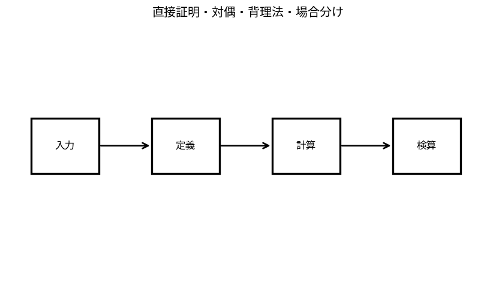

# 直接証明・対偶・背理法・場合分け

Course 04｜離散数学と証明｜Topic 04/20

---
layout: center
---

## 今回の問い

## 到達目標

- 定義と代表式を、自分の言葉と記号で説明できる。
- 成立条件を確認し、手計算と結果を検算できる。

## 理解確認

- 定義・条件・計算結果を自分の言葉で説明できるか確認する。

直接証明・対偶・背理法・場合分けの代表式は、どの定義・仮定から、なぜその形になるのか。

---

## なぜ今これを学ぶのか

前Topic `dm-implication-equivalence-conditions` で得た概念を使い、ここでは 直接証明・対偶・背理法・場合分け へ進む。

---

## 直感

証明は結論が仮定から必ず従うことを、許された推論でつなぐ構造。

---

## 図解

命題→対偶→反例候補を図で分岐させ、どの証明法が合うか整理する。 矢印は仮定から結論へ進む論理の向きを表す。直接証明、対偶、背理法は結論自体を変えるのではなく、同値な論理形へ問題を組み替える方法である。

---

## 記号と代表式

- $P\Rightarrow Q$：証明したい含意
- $\neg Q\Rightarrow\neg P$：対偶
- $\bot$：矛盾

$$
(P\Longrightarrow Q)\equiv(\neg Q\Longrightarrow\neg P)
$$

---

## 導出 1

$P\Rightarrow Q\equiv\neg P\lor Q$。対偶 $\neg Q\Rightarrow\neg P\equiv Q\lor\neg P$ で、可換律により同じ。

---

## 導出 2

示したい命題Rに対し $\neg R$ を仮定し矛盾 $\bot$ を導けば、$\neg R$ は成立不能なのでR。

---

## 例題

「n²が偶数ならnは偶数」を対偶で示す。nが奇数ならn=2k+1、n²=4k²+4k+1=2(2k²+2k)+1で奇数。よって対偶が真。

---

## 条件を変えるとどうなるか

結論Qを仮定してQを導く循環論法は証明ではない。証明中に何を仮定してよいかを明記する必要がある。

---

## よくある誤解

直接証明・対偶・背理法・場合分けでは、式へ数値を代入するだけでは不十分である。結論Qを仮定してQを導く循環論法は証明ではない。証明中に何を仮定してよいかを明記する必要がある。 という失敗例が示すように、式を使える条件と結論の範囲を区別する必要がある。

---

## 実装・計算上の注意

program correctnessの証明でも、assertionを「観察したから正しい」とせず、preconditionからpostconditionを論理的に導く。property-based testingは証明ではないが反例探索には強い。

---

## 一段先へ

帰納法は「全自然数について」の証明を、base caseと一段進める含意へ分解する専用手法。

---

## 自分で説明できるか

- 「対偶が同値である理由」を式を見ずに説明できるか
- 「場合分け」までの論理を一段ずつ再現できるか
- 直接証明・対偶・背理法・場合分けの条件を1つ外した反例を説明できるか

---
layout: center
---

## 教科書と演習

- [教科書](../../textbook/dm-proof-methods)
- [10問の演習](../../exercises/dm-proof-methods)
