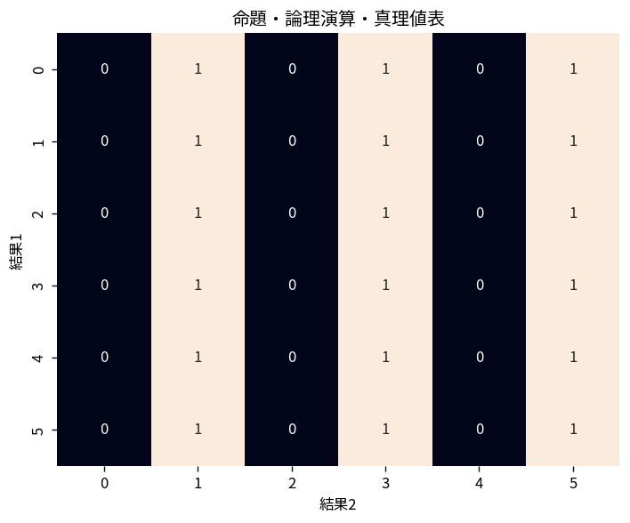

# 命題・論理演算・真理値表

Course 04｜離散数学と証明｜Topic 01/20

---
layout: center
---

## 今回の問い

## 到達目標

- 定義と代表式を、自分の言葉と記号で説明できる。
- 成立条件を確認し、手計算と結果を検算できる。

## 理解確認

- 定義・条件・計算結果を自分の言葉で説明できるか確認する。

命題・論理演算・真理値表の代表式は、どの定義・仮定から、なぜその形になるのか。

---

## なぜ今これを学ぶのか

Course 04 の入口として、命題・論理演算・真理値表 を定義から組み立てる。

---

## 直感

論理式は真偽値を入力として別の真偽値を返す関数として扱える。

---

## 図解

2命題P,Qの全4ケースを真理値表で列挙する。 行は命題変数の全ての真偽割当てである。列を左から計算すると、複合命題が全割当てで真か、ある割当てで偽かを機械的に判定できる。

---

## 記号と代表式

- $P,Q$：真または偽をとる命題
- $\neg P$：Pの否定
- $P\land Q$：論理積
- $P\lor Q$：論理和
- $P\Rightarrow Q$：含意

$$
P\Longrightarrow Q\equiv\neg P\lor Q
$$

---

## 導出 1

「PならばQ」という約束に違反するのは、前件Pが成立したのに後件Qが成立しない場合だけ。したがって偽条件は $P\land\neg Q$。

---

## 導出 2

含意そのものはその違反がない条件なので $\neg(P\land\neg Q)$。De Morgan則で $\neg P\lor Q$。よって $P\Rightarrow Q\equiv\neg P\lor Q$。

---

## 例題

$P$:「nは4の倍数」、$Q$:「nは2の倍数」。P真Q偽は起こらないため $P\Rightarrow Q$ は常に真。

---

## 条件を変えるとどうなるか

逆 $Q\Rightarrow P$ は元の含意と同値ではない。n=2なら「2の倍数」Qは真だが「4の倍数」Pは偽。

---

## よくある誤解

命題・論理演算・真理値表では、式へ数値を代入するだけでは不十分である。逆 $Q\Rightarrow P$ は元の含意と同値ではない。n=2なら「2の倍数」Qは真だが「4の倍数」Pは偽。 という失敗例が示すように、式を使える条件と結論の範囲を区別する必要がある。

---

## 実装・計算上の注意

boolean式をコードに写すときは演算子優先順位とshort-circuitを論理式そのものと区別する。全入力を列挙するtestは小さい論理式の同値確認に有効。

---

## 一段先へ

含意の構造を理解すると、対偶・必要十分条件・証明方法の選択が整理できる。

---

## 自分で説明できるか

- 「含意が偽になる条件を特定する」を式を見ずに説明できるか
- 「真理値表で全場合を照合する」までの論理を一段ずつ再現できるか
- 命題・論理演算・真理値表の条件を1つ外した反例を説明できるか

---
layout: center
---

## 教科書と演習

- [教科書](../../textbook/dm-propositions-connectives-truth-tables)
- [10問の演習](../../exercises/dm-propositions-connectives-truth-tables)
