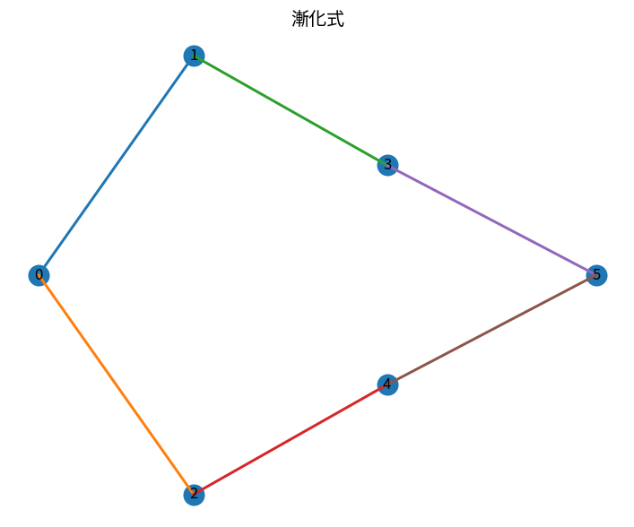

# 漸化式

Course 04｜離散数学と証明｜Topic 14/20

---
layout: center
---

## 今回の問い

## 到達目標

- 定義と代表式を、自分の言葉と記号で説明できる。
- 成立条件を確認し、手計算と結果を検算できる。

## 理解確認

- 定義・条件・計算結果を自分の言葉で説明できるか確認する。

漸化式の代表式は、どの定義・仮定から、なぜその形になるのか。

---

## なぜ今これを学ぶのか

前Topic `dm-asymptotic-notation-growth-rates` で得た概念を使い、ここでは 漸化式 へ進む。

---

## 直感

関係は要素間のペアの集合で、同値関係は分類、半順序は比較可能性の構造を作る。

---

## 図解

小集合上の関係を有向辺で描き、反射・対称・推移を確認する。 点が集合の要素、矢印が関係を表す。反射性は自己ループ、対称性は逆向き矢印の対、推移性は2本の矢印があれば短絡する矢印も必要、という形で確認できる。

---

## 記号と代表式

- $T(n)$：入力size nの量/計算時間
- $T(n)=T(n-1)+n$：前状態との関係
- $T(0)$：base condition

$$
T(n)=T(n-1)+n
$$

---

## 導出 1

$T(n)=T(n-1)+n=T(n-2)+(n-1)+n=\cdots=T(0)+\sum_{k=1}^n k$。

---

## 導出 2

$\sum_{k=1}^n k=n(n+1)/2$ なので $T(n)=T(0)+n(n+1)/2$。

---

## 例題

$T(n)=2T(n/2)+n$ を展開すると各levelの総costがn、level数log₂nなのでΘ(n log n)。

---

## 条件を変えるとどうなるか

同じrecurrenceでもbase conditionが違えば解は異なる。漸化式だけ書いて初期値を無視すると一意に定まらない。

---

## よくある誤解

漸化式では、式へ数値を代入するだけでは不十分である。同じrecurrenceでもbase conditionが違えば解は異なる。漸化式だけ書いて初期値を無視すると一意に定まらない。 という失敗例が示すように、式を使える条件と結論の範囲を区別する必要がある。

---

## 実装・計算上の注意

memoizationで再帰計算の重複を除くことと、数学的recurrenceを解くことは別。stack depthやinteger growthも実装では確認する。

---

## 一段先へ

分割統治recurrence $aT(n/b)+f(n)$ の典型orderをまとめるMaster theoremへ進む。

---

## 自分で説明できるか

- 「展開する」を式を見ずに説明できるか
- 「検算」までの論理を一段ずつ再現できるか
- 漸化式の条件を1つ外した反例を説明できるか

---
layout: center
---

## 教科書と演習

- [教科書](../../textbook/dm-recurrence-relations)
- [10問の演習](../../exercises/dm-recurrence-relations)
