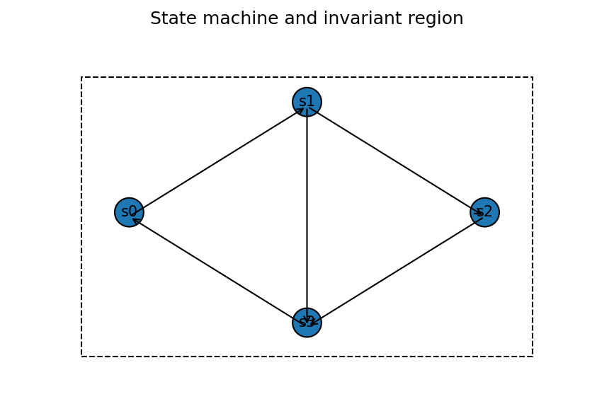

# 状態機械と不変量

Course 04｜離散数学

---

## 何を解決するか

時間とともに状態が変わる系の正しさを、毎step追わずにどう証明するか。

状態機械は「状態」と「許される遷移」を明示する。不変量は初期状態で真で、遷移しても真のまま残る性質なので、到達可能状態全体を一括して制約できる。

---

## 図の意味

各円が状態、矢印が1stepで許された遷移。破線の囲みが性質 $I$ を満たす状態集合で、初期状態が囲みの中にあり、囲みの中から出る遷移が存在しないなら、何step進めても外へ出ない。この閉性が不変量の帰納stepに対応する。

---

## 記号

| 記号 | 意味 |
|---|---|
| $S$ | 状態集合 |
| $→$ | 遷移関係 |
| $I(s)$ | 状態sで成り立たせたい不変量 |

- $S$：状態集合、$s_0$：初期状態。
- $s\to s'$：1step遷移。
- $I(s)$：状態sで真偽を持つ不変量候補。

---

## 中心式

$$
I(s_0)\land[I(s)\land s\to s\prime\Rightarrow I(s\prime)]
$$

---

## 導出

1. 初期状態でIを確認する。
2. 任意の1step遷移がIを保存することを示す。
3. 帰納法により任意step後の到達可能状態でIが成り立つ。

---

## 省略しない一段

state machineを $(S,S_0,\to)$ として、状態集合S、初期状態集合 $S_0$、遷移関係 $\to$ を分ける。不変量Iは到達可能なすべての状態で真にしたい命題。証明は数学的帰納法そのもの。

baseとして全初期状態でIを示し、stepとして $I(s)$ かつ $s\to s\prime$ なら $I(s\prime)$ を示す。すると長さkの任意の実行について帰納的にIが保存される。個々の実行を列挙しなくてよいのが強み。

---

## 手計算

**問題**：初期値 $x=1$、各stepで $x\leftarrow x+4$ または $x\leftarrow x-8$ とする。$x\equiv1\pmod4$ が不変量であることを示し、x=6が到達不能と結論せよ。

**解答**：初期1はmod4で1。+4も-8も4の倍数を加えるので剰余1を保存する。帰納法により全到達状態で $x\equiv1\pmod4$。6はmod4で2なので到達不能。

---

## 条件を変える

整数xを0から開始し、各stepでxへ2を足す機械を考える。「xは偶数」が不変量。初期0は偶数、偶数+2は偶数なので全到達状態で偶数。したがってx=5は到達不能。

---

## どこで壊れるか

初期状態で真でもstep保存を示していなければ不変量ではない。逆に保存されても初期状態で偽なら到達状態について何も言えない。baseとstepを必ず分離する。

---

## 次へ

loop invariant、distributed protocol、安全性証明へ直結する。動的系や最適化アルゴリズムでも「反復で保たれる集合・量」を探す考えが再登場する。

---

[教科書](../../textbook/dm-state-machines-invariants)　|　[10問の演習](../../exercises/dm-state-machines-invariants)

---

## 今回の問い

「状態機械と不変量」は何を表し、どの条件で使え、結果をどう検算するのか？

---

## 到達目標

- 時間とともに状態が変わる系の正しさを、毎step追わずにどう証明するか。
- 中心式の記号と成立条件を説明できる
- 小さい例と反例で検算できる

---

## 理解確認

1. 時間とともに状態が変わる系の正しさを、毎step追わずにどう証明するか。
2. 中心式の記号と成立条件を説明できる
3. 小さい例と反例で検算できる
