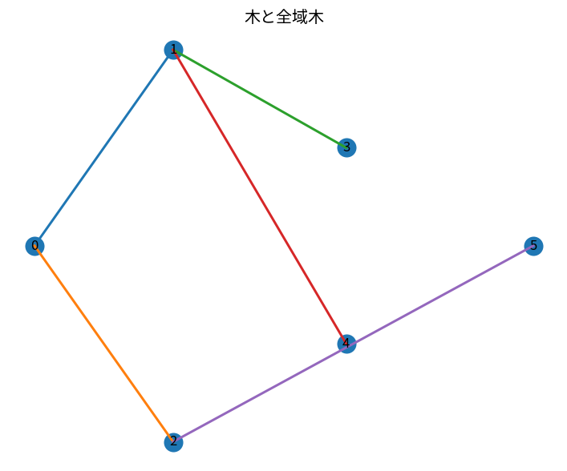

# 木と全域木

Course 04｜離散数学と証明｜Topic 18/20

---
layout: center
---

## 今回の問い

## 到達目標

- 定義と代表式を、自分の言葉と記号で説明できる。
- 成立条件を確認し、手計算と結果を検算できる。

## 理解確認

- 定義・条件・計算結果を自分の言葉で説明できるか確認する。

木と全域木の代表式は、どの定義・仮定から、なぜその形になるのか。

---

## なぜ今これを学ぶのか

前Topic `dm-paths-cycles-connectivity` で得た概念を使い、ここでは 木と全域木 へ進む。

---

## 直感

木は閉路を持たず連結なグラフで、頂点数nなら辺数はn-1になる。

---

## 図解

木へ1本ずつ辺を追加し、閉路が生じる境界を見る。 根から各頂点へ唯一の単純pathがある構造がtreeである。辺を1本足すとcycleが生じ、1本除くと分断されるという最小連結性が図の枝構造に現れる。

---

## 記号と代表式

- $T=(V,E)$：tree
- $|V|=n$
- $|E|$：edge数
- spanning tree：元graphの全vertexを含むtree

$$
|E|=|V|-1
$$

---

## 導出 1

n=1でedge0。n>1のtreeにはleafが存在し、leafとそのedgeを除くとn-1 vertexのtree。帰納仮定でedge n-2、戻してn-1。

---

## 導出 2

2本の異なるsimple pathがあれば、分岐して再合流する部分がcycleを作る。cycleなしなのでpathは一意。

---

## 例題

4vertex pathは3edgeでtree。edgeを1本足してcycleを作るとtreeでなくなる。

---

## 条件を変えるとどうなるか

$|E|=|V|-1$ だけではtreeを保証しない。disconnectで片componentにcycleがあるgraphでも総edge数だけ一致し得る。connectedness等追加条件が必要。

---

## よくある誤解

木と全域木では、式へ数値を代入するだけでは不十分である。$|E|=|V|-1$ だけではtreeを保証しない。disconnectで片componentにcycleがあるgraphでも総edge数だけ一致し得る。connectedness等追加条件が必要。 という失敗例が示すように、式を使える条件と結論の範囲を区別する必要がある。

---

## 実装・計算上の注意

DFS parentを使えばspanning treeを構成できる。再帰DFSは深いtreeでstack overflowに注意。

---

## 一段先へ

方向を付けてcycleを禁止するとDAGになり、依存関係とtopological orderingを扱える。

---

## 自分で説明できるか

- 「leafを使う帰納法」を式を見ずに説明できるか
- 「spanning tree」までの論理を一段ずつ再現できるか
- 木と全域木の条件を1つ外した反例を説明できるか

---
layout: center
---

## 教科書と演習

- [教科書](../../textbook/dm-trees-spanning-trees)
- [10問の演習](../../exercises/dm-trees-spanning-trees)
