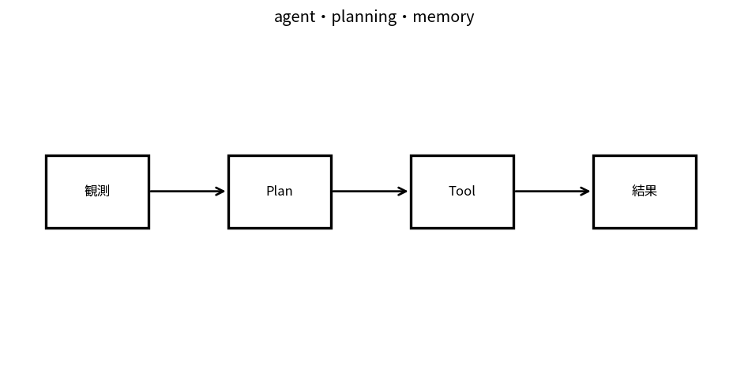

# agent・planning・memory

Course 10｜Frontier｜Topic 09/20

---
layout: center
---

## 今回の問い

## 到達目標

- 定義と代表式を、自分の言葉と記号で説明できる。
- 成立条件を確認し、手計算と結果を検算できる。

## 理解確認

- 定義・条件・計算結果を自分の言葉で説明できるか確認する。

agent・planning・memoryの代表式は、どの定義・仮定から、なぜその形になるのか。

---

## なぜ今これを学ぶのか

前Topic `frontier-tool-use-function-calling` で得た概念を使い、ここでは agent・planning・memory へ進む。

---

## 直感

agentは観測→状態更新→action/tool選択→結果観測を繰り返す閉ループsystem。

---

## 図解

plan, act, observe, memoryの循環を矢印で描く。 model出力がtool actionを選び、tool observationが次のmodel入力へ戻るloopを描く。単発生成と違い、外部状態の変化を観測しながら複数stepで方針を更新する。

---

## 記号と代表式

- $\tau=(s_0,a_0,o_1,\ldots,s_T)$：trajectory
- $g$：goal
- $m_t$：external/working memory
- $T$：horizon

$$
\tau=(s_0,a_0,o_1,\ldots,s_T)
$$

---

## 導出 1

単発tool callではa_0だけ。multi-stepではaction resultが次stateを変え、future choiceへ依存。

---

## 導出 2

goalをsubgoalsへ分解し、preconditions/dependenciesを順序付ける。environment feedbackでplanを再計画。

---

## 例題

trip task: requirements収集→search→compare→calendar check→booking前confirmation。各stepのresultが次へ。

---

## 条件を変えるとどうなるか

長いplanを最初に固定し続けるとenvironment change/failed actionでerror propagation。

---

## よくある誤解

agent・planning・memoryでは、式へ数値を代入するだけでは不十分である。長いplanを最初に固定し続けるとenvironment change/failed actionでerror propagation。 という失敗例が示すように、式を使える条件と結論の範囲を区別する必要がある。

---

## 実装・計算上の注意

state machine、max steps、loop detection、tool budgets、checkpoint/recovery、memory provenance。

---

## 一段先へ

agentが複数になるとcoordination/game-theoretic interactionとcommunication overheadが追加される。

---

## 自分で説明できるか

- 「one-stepからtrajectoryへ」を式を見ずに説明できるか
- 「memory selection」までの論理を一段ずつ再現できるか
- agent・planning・memoryの条件を1つ外した反例を説明できるか

---
layout: center
---

## 教科書と演習

- [教科書](../../textbook/frontier-agents-planning-memory)
- [10問の演習](../../exercises/frontier-agents-planning-memory)
