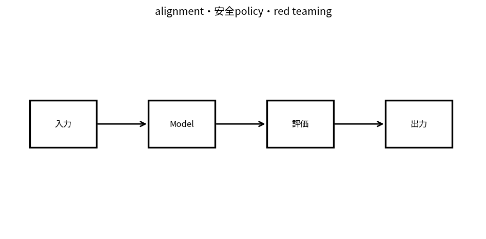

# alignment・安全policy・red teaming

Course 10｜Frontier｜Topic 12/20

---
layout: center
---

## 今回の問い

## 到達目標

- 定義と代表式を、自分の言葉と記号で説明できる。
- 成立条件を確認し、手計算と結果を検算できる。

## 理解確認

- 定義・条件・計算結果を自分の言葉で説明できるか確認する。

alignment・安全policy・red teamingの代表式は、どの定義・仮定から、なぜその形になるのか。

---

## なぜ今これを学ぶのか

前Topic `frontier-rlhf-preference-optimization` で得た概念を使い、ここでは alignment・安全policy・red teaming へ進む。

---

## 直感

alignmentとred teamingは、意図したpolicyと実際のmodel挙動の差を攻撃的テストで探す。

---

## 図解

通常testとadversarial testを分けた評価matrixを描く。 model capabilityの経路に対し、policy・preference・safety constraint・evaluationを別レイヤとして重ねる。性能向上と望ましい振る舞いは同じ目的関数ではない。

---

## 記号と代表式

- $\mathcal X_{adv}$：adversarial/test space
- $Risk(f,x)$：harm/failure score
- $P$：policy/constraints
- threat model

$$
\max_{x\in\mathcal{X}_{adv}}\operatorname{Risk}(f_\theta,x)
$$

---

## 導出 1

誰が何をでき、何を守るかを定義しないと「安全」の検証範囲が決まらない。

---

## 導出 2

$\max_{x\in X_{adv}}Risk$ はred-team/adversarial evaluationの抽象形。search methodが弱いとriskを過小評価。

---

## 例題

tool agentでread-only questionとmoney transferに同じpermission thresholdを使わずimpact別control。

---

## 条件を変えるとどうなるか

特定benchmark scoreが高い=all-context safeではない。unknown attacks/distribution shiftを残す。

---

## よくある誤解

alignment・安全policy・red teamingでは、式へ数値を代入するだけでは不十分である。特定benchmark scoreが高い=all-context safeではない。unknown attacks/distribution shiftを残す。 という失敗例が示すように、式を使える条件と結論の範囲を区別する必要がある。

---

## 実装・計算上の注意

incident taxonomy、red-team dataset version、policy changes、false positive/negative、human escalation。

---

## 一段先へ

安全を含むfoundation model evaluationをstatistical experimentとして設計する。

---

## 自分で説明できるか

- 「threat model」を式を見ずに説明できるか
- 「defense in depth」までの論理を一段ずつ再現できるか
- alignment・安全policy・red teamingの条件を1つ外した反例を説明できるか

---
layout: center
---

## 教科書と演習

- [教科書](../../textbook/frontier-alignment-safety-policies)
- [10問の演習](../../exercises/frontier-alignment-safety-policies)
