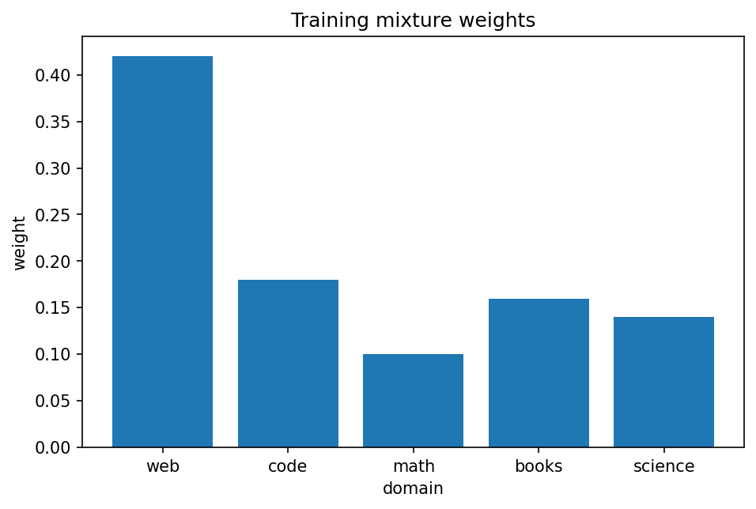

# pretraining data：dedup・mixture・contamination

Course 10｜Frontier

---

## 何を解決するか

同じtoken数でも、重複・domain mixture・benchmark contaminationで学習結果がなぜ変わるか。

training dataは単なる量ではなく分布。重複は特定sampleを過度に重み付けし、mixture weightは能力配分を変え、evaluation setの混入は測定を汚染する。

---

## 図の意味

棒グラフの各棒がweb/code/math/books/scienceなどdomainのsampling weight $w_k$。総和1のmixtureからbatchがsampleされるので、棒の高さがtraining gradientへ各domainが現れる頻度を決める。dedupやfilterをすると同じ棒の中身のdistribution自体も変わる。

---

## 記号

| 記号 | 意味 |
|---|---|
| $D_k$ | domain kのdata distribution |
| $w_k$ | mixture weight |
| $D_train$ | 混合training distribution |

- $D_k$：domain kのdata distribution。
- $w_k$：sampling weight、$w_k\ge0$, $\sum_kw_k=1$。
- contamination：evaluation dataまたは近似内容がtrainingへ混入すること。

---

## 中心式

$$
D_{train}=\sum_k w_kD_k,\quad w_k\ge0,\;\sum_kw_k=1
$$

---

## 導出

1. 各sourceをdomain distributionとしてみなす。
2. sampling weight w_kが期待gradientへの寄与を決める。
3. dedup/filteringはeffective distributionそのものを変えるため、token countだけで比較できない。

---

## 省略しない一段

training corpusを単なるtoken集合でなくmixture distribution $D=\sum_kw_kD_k$ と見ると、weight変更はobjective $E_D[loss]$ の期待値を直接変える。domain size比例だけが唯一の選択ではなく、qualityやtarget能力に応じてreweightできる。

dedupは近重複documentを除いてeffective sample diversityを増やし、memorizationを抑える可能性がある。benchmark contaminationはevaluation itemや近似解答がtrainingに入ることで、generalizationではなくmemorizationを測る危険。

---

## 手計算

**問題**：総training budget 200B tokenで mixture weightが web=0.5, code=0.2, math=0.1, books=0.2 のとき各domainの期待token数を求めよ。

**解答**：web 100B, code 40B, math 20B, books 40B。weightの総和が1であることも検算する。

---

## 条件を変える

100B token budgetでcode weightを10%→20%にすれば期待code tokenは10B→20B。その分ほかdomainのtoken機会が10B減るので、改善と退化のtrade-offを評価する必要がある。

---

## どこで壊れるか

「重複を全部消せば常に良い」とは限らない。頻出patternの正当な繰り返しや多言語parallel dataまで誤って落とすとcoverageを失う。dedup thresholdとunit(document/span)を明示する。

---

## 次へ

data scaling law、curriculum/data scheduling、synthetic data、evaluation contamination detectionへつながる。model architectureだけでなくdata pipelineが能力を決める。

---

[教科書](../../textbook/frontier-data-dedup-mixtures-contamination)　|　[10問の演習](../../exercises/frontier-data-dedup-mixtures-contamination)
