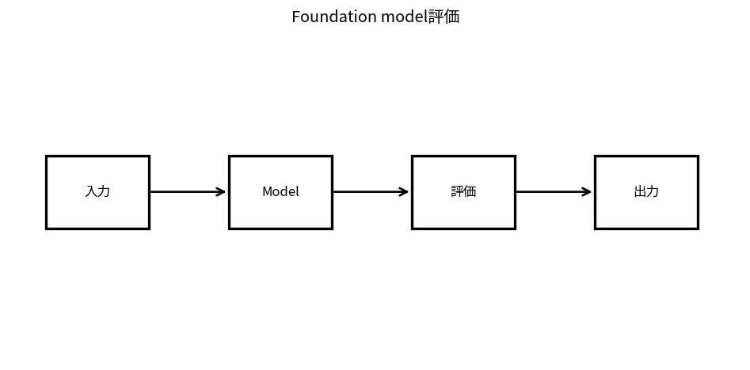

# Foundation model評価

Course 10｜Frontier｜Topic 13/20

---
layout: center
---

## 今回の問い

## 到達目標

- 定義と代表式を、自分の言葉と記号で説明できる。
- 成立条件を確認し、手計算と結果を検算できる。

## 理解確認

- 定義・条件・計算結果を自分の言葉で説明できるか確認する。

Foundation model評価の代表式は、どの定義・仮定から、なぜその形になるのか。

---

## なぜ今これを学ぶのか

前Topic `frontier-alignment-safety-policies` で得た概念を使い、ここでは Foundation model評価 へ進む。

---

## 直感

Foundation model評価ではtask平均だけでなく、subgroup、variance、judge bias、contaminationを分離して測る。

---

## 図解

複数benchmarkのscoreとconfidence intervalを並べる。 taskごとの入力→出力→scoringを分離し、平均scoreだけでなくslice・failure type・contaminationも追う。benchmark値は測定設計の結果である。

---

## 記号と代表式

- $s_A^{(i)},s_B^{(i)}$：item iのmodel scores
- $\hat\Delta=n^{-1}\sum(s_A-s_B)$：paired effect estimate
- $n$：evaluation items

$$
\widehat{\Delta}=\frac{1}{n}\sum_i(s_A^{(i)}-s_B^{(i)})
$$

---

## 導出 1

$d_i=s_A^{(i)}-s_B^{(i)}$ を作るとitem-specific common difficultyが差でcancel。

---

## 導出 2

$\hat\Delta=\bar d$、SE≈s_d/√n。point estimateだけでranking certaintyを語らない。

---

## 例題

同じ1000 promptsでA/Bを評価しbootstrap CI of paired score difference。

---

## 条件を変えるとどうなるか

leaderboard差0.2ptをn/variance無視して「優位」と断言できない。

---

## よくある誤解

Foundation model評価では、式へ数値を代入するだけでは不十分である。leaderboard差0.2ptをn/variance無視して「優位」と断言できない。 という失敗例が示すように、式を使える条件と結論の範囲を区別する必要がある。

---

## 実装・計算上の注意

eval prompt/version/model snapshot、sampling temperature、judge rubric、contamination check、raw per-item results。

---

## 一段先へ

aggregate scoreで見えない内部mechanismをinterpretabilityで調べる。

---

## 自分で説明できるか

- 「paired differences」を式を見ずに説明できるか
- 「multiple dimensions」までの論理を一段ずつ再現できるか
- Foundation model評価の条件を1つ外した反例を説明できるか

---
layout: center
---

## 教科書と演習

- [教科書](../../textbook/frontier-foundation-model-evaluation)
- [10問の演習](../../exercises/frontier-foundation-model-evaluation)
