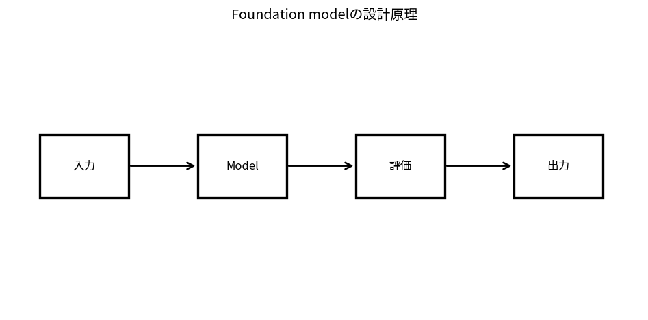

# Foundation modelの設計原理

Course 10｜Frontier｜Topic 01/20

---
layout: center
---

## 今回の問い

## 到達目標

- 定義と代表式を、自分の言葉と記号で説明できる。
- 成立条件を確認し、手計算と結果を検算できる。

## 理解確認

- 定義・条件・計算結果を自分の言葉で説明できるか確認する。

Foundation modelの設計原理の代表式は、どの定義・仮定から、なぜその形になるのか。

---

## なぜ今これを学ぶのか

Course 10 の入口として、Foundation modelの設計原理 を定義から組み立てる。

---

## 直感

Foundation modelは大規模な事前学習で汎用表現・生成能力を獲得し、下流taskへ適応する。

---

## 図解

pretraining→adaptation→taskの流れを大きなpipelineとして描く。 大量dataでpretrainingした共通modelを、prompt・retrieval・fine-tuning等で個別taskへ適応する。基盤部分を共有するため下流taskごとの学習量を減らせる。

---

## 記号と代表式

- $x_1,\ldots,x_T$：token sequence
- $p_\theta$：parameter θのmodel distribution
- $x_{<t}$：時刻tより前のtokens
- $T$：sequence length

$$
p_\theta(x_1,\ldots,x_T)=\prod_{t=1}^{T}p_\theta(x_t\mid x_{<t})
$$

---

## 導出 1

$p(x_1,\ldots,x_T)=p(x_1)p(x_2|x_1)\cdots p(x_T|x_{<T})$。独立仮定ではなく確率のchain rule。

---

## 導出 2

negative logを取ると積が和へ変わり $-\sum_t\log p_\theta(x_t|x_{<t})$。teacher forcingで各positionをsupervisionとして使える。

---

## 例題

3-token sequence probabilityはp(x1)p(x2|x1)p(x3|x1,x2)。各factorが低ければjointも低くなる。

---

## 条件を変えるとどうなるか

next-token likelihoodが高いこととfactual correctness/safety/task successは同義でない。training objectiveとdownstream metricを区別する。

---

## よくある誤解

Foundation modelの設計原理では、式へ数値を代入するだけでは不十分である。next-token likelihoodが高いこととfactual correctness/safety/task successは同義でない。training objectiveとdownstream metricを区別する。 という失敗例が示すように、式を使える条件と結論の範囲を区別する必要がある。

---

## 実装・計算上の注意

token-level cross entropy、padding mask、context truncation、data deduplicationを記録。generationはtemperature/top-p等decoder settingで出力distributionが変わる。

---

## 一段先へ

next-token modelが扱う最小単位tokenと、そのembedding/context representationを次に理解する。

---

## 自分で説明できるか

- 「probability chain rule」を式を見ずに説明できるか
- 「generation」までの論理を一段ずつ再現できるか
- Foundation modelの設計原理の条件を1つ外した反例を説明できるか

---
layout: center
---

## 教科書と演習

- [教科書](../../textbook/frontier-foundation-model-paradigm)
- [10問の演習](../../exercises/frontier-foundation-model-paradigm)
