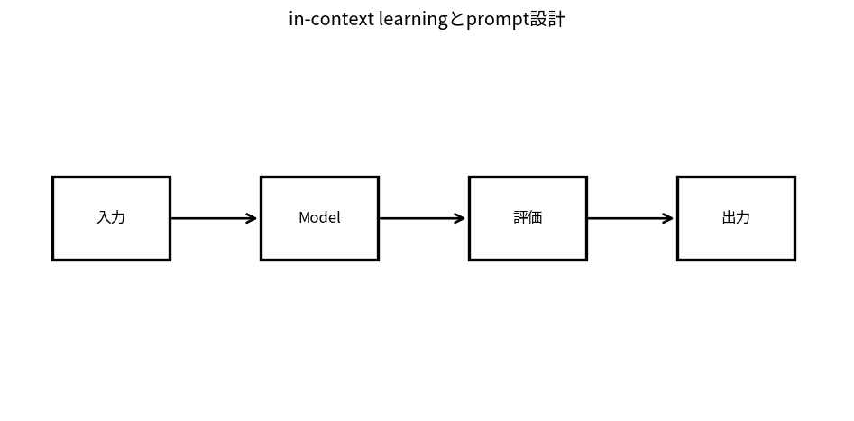

# in-context learningとprompt設計

Course 10｜Frontier｜Topic 04/20

---
layout: center
---

## 今回の問い

## 到達目標

- 定義と代表式を、自分の言葉と記号で説明できる。
- 成立条件を確認し、手計算と結果を検算できる。

## 理解確認

- 定義・条件・計算結果を自分の言葉で説明できるか確認する。

in-context learningとprompt設計の代表式は、どの定義・仮定から、なぜその形になるのか。

---

## なぜ今これを学ぶのか

前Topic `frontier-pretraining-scaling-laws` で得た概念を使い、ここでは in-context learningとprompt設計 へ進む。

---

## 直感

in-context learningではparameterを更新せず、context内の例・指示からtaskを推論する。

---

## 図解

instructionとfew-shot例がqueryへ情報を流す模式図を見る。 instruction・demonstration・queryが同じcontextへ入り、parameter更新なしに次token分布を変える。few-shot例はtraining dataではなく推論時条件として働く。

---

## 記号と代表式

- $\mathcal C$：prompt内のinstructions/examples/context
- $x$：query
- $p(y|x,\mathcal C)$：context-conditioned output

$$
p(y\mid x,\mathcal{C})
$$

---

## 導出 1

pretrained conditional distributionに追加context Cを入れることで $p(y|x)$ から $p(y|x,C)$ へ変化。

---

## 導出 2

input-output pairsをcontextへ置くとattention等を通じpattern/format/task informationがcurrent query representationへ影響。

---

## 例題

2 examplesでsentiment output formatを示し、3つ目queryだけをask。parameter updateなしでlabel vocabularyをcontextから使える。

---

## 条件を変えるとどうなるか

promptで1回成功したexampleをgeneral capability proofにしない。prompt overfittingとtest contaminationを区別する。

---

## よくある誤解

in-context learningとprompt設計では、式へ数値を代入するだけでは不十分である。promptで1回成功したexampleをgeneral capability proofにしない。prompt overfittingとtest contaminationを区別する。 という失敗例が示すように、式を使える条件と結論の範囲を区別する必要がある。

---

## 実装・計算上の注意

prompt template/version、system/user separation、temperature、few-shot examplesをartifact化して評価。

---

## 一段先へ

promptだけで不足するとき、base model weightsの小部分/low-rank updateを学ぶparameter-efficient fine-tuningへ。

---

## 自分で説明できるか

- 「conditioning viewpoint」を式を見ずに説明できるか
- 「order/format sensitivity」までの論理を一段ずつ再現できるか
- in-context learningとprompt設計の条件を1つ外した反例を説明できるか

---
layout: center
---

## 教科書と演習

- [教科書](../../textbook/frontier-in-context-learning-prompting)
- [10問の演習](../../exercises/frontier-in-context-learning-prompting)
