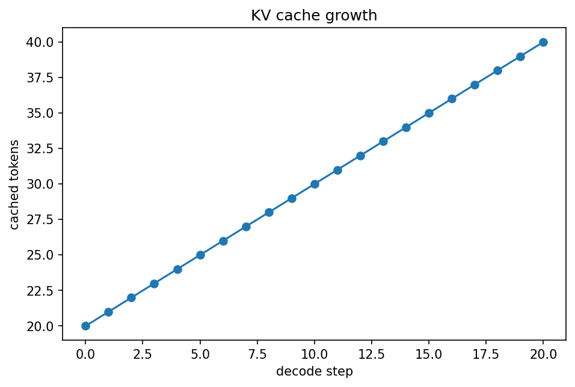
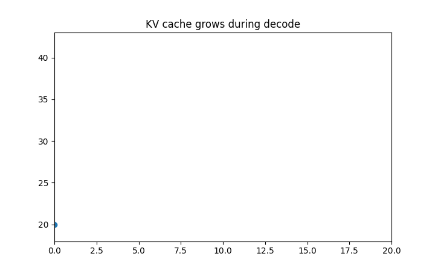

# LLM推論：prefill・decode・KV cache

Course 10｜Frontier

---

## 今回の問い

LLM inferenceでprompt処理と1 tokenずつの生成は、計算特性がなぜ異なるか。

---

## 直感

prefillはprompt全tokenを並列に処理しmatrix multiplicationが大きい。decodeは過去K/Vをcacheして1 tokenずつ進み、batchやmodelによってmemory bandwidth支配になりやすい。

---

## 図解

---

## 動きで確認

---

## 中心式

$$
\mathrm{Attention}(q_t,K_{\le t},V_{\le t})=\mathrm{softmax}(q_tK_{\le t}^T/\sqrt d)V_{\le t}
$$

---

## 導出

1. autoregressive生成では過去tokenのK,Vは次stepでも同じ。
2. 毎step再計算せずcacheへ保存する。
3. 計算量を減らす代わりにcontext長に比例するKV memoryを消費する。

---

## 小さい例

長いpromptの最初はprefill latency、長い生成ではper-token decode latencyとKV cache容量が重要になる。

---

## 条件を外すと

- training throughputとdecode latencyを同じ指標で比較しない。
- GQA/MQA等でKV cache量が変わる。

---

## 理解確認

- 式の各記号を定義できるか。
- 導出を1段ずつ再現できるか。
- 反例を1つ作れるか。

---

## 教科書と演習

[教科書](../../textbook/frontier-inference-prefill-decode-kv-cache)

[10問の演習](../../exercises/frontier-inference-prefill-decode-kv-cache)
