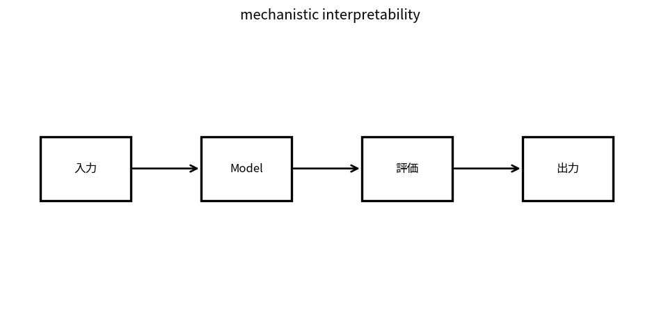

# mechanistic interpretability

Course 10｜Frontier｜Topic 14/20

---
layout: center
---

## 今回の問い

## 到達目標

- 定義と代表式を、自分の言葉と記号で説明できる。
- 成立条件を確認し、手計算と結果を検算できる。

## 理解確認

- 定義・条件・計算結果を自分の言葉で説明できるか確認する。

mechanistic interpretabilityの代表式は、どの定義・仮定から、なぜその形になるのか。

---

## なぜ今これを学ぶのか

前Topic `frontier-foundation-model-evaluation` で得た概念を使い、ここでは mechanistic interpretability へ進む。

---

## 直感

mechanistic interpretabilityは内部activationや回路を観測し、特定の計算がどのcomponentで実現されるかを追う。

---

## 図解

layerごとのactivationをnode graphとして強調する。 内部activationや重みから観測可能な量を抽出し、入力変更との因果的関係を検証する。可視化されたcorrelationだけで機構を断定しない。

---

## 記号と代表式

- $h^{(l)}$：layer l activations
- $F_l$：layer transform
- feature/circuit/probe

$$
\mathbf{h}^{(l+1)}=F_l(\mathbf{h}^{(l)})
$$

---

## 導出 1

$h^{l+1}=F_l(h^l)$。behaviorは多数layers/pathsのcomposition。

---

## 導出 2

activationからpropertyをpredictできることはinformation presenceを示すが、そのinformationがbehaviorに使われることを証明しない。

---

## 例題

particular head ablationでspecific task scoreが落ちるか、matched controlsと比較。

---

## 条件を変えるとどうなるか

attention visualizationだけでreasoning circuitを確定しない。

---

## よくある誤解

mechanistic interpretabilityでは、式へ数値を代入するだけでは不十分である。attention visualizationだけでreasoning circuitを確定しない。 という失敗例が示すように、式を使える条件と結論の範囲を区別する必要がある。

---

## 実装・計算上の注意

baseline/control, multiple examples, layer normalization confounds, reproducible hooks。

---

## 一段先へ

internal understandingだけでなくoutput confidenceをcalibrateし必要ならabstainするdecision policyへ。

---

## 自分で説明できるか

- 「layer composition」を式を見ずに説明できるか
- 「intervention」までの論理を一段ずつ再現できるか
- mechanistic interpretabilityの条件を1つ外した反例を説明できるか

---
layout: center
---

## 教科書と演習

- [教科書](../../textbook/frontier-interpretability-mechanistic)
- [10問の演習](../../exercises/frontier-interpretability-mechanistic)
