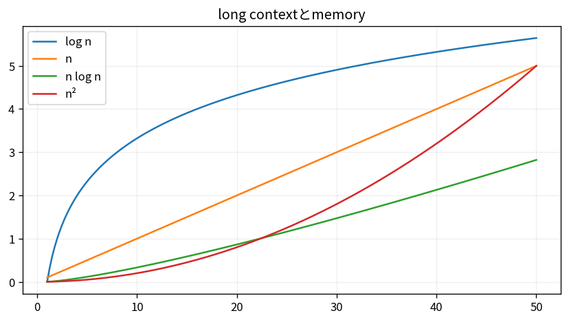

# long contextとmemory

Course 10｜Frontier｜Topic 17/20

---
layout: center
---

## 今回の問い

## 到達目標

- 定義と代表式を、自分の言葉と記号で説明できる。
- 成立条件を確認し、手計算と結果を検算できる。

## 理解確認

- 定義・条件・計算結果を自分の言葉で説明できるか確認する。

long contextとmemoryの代表式は、どの定義・仮定から、なぜその形になるのか。

---

## なぜ今これを学ぶのか

前Topic `frontier-quantization-sparsity-moe` で得た概念を使い、ここでは long contextとmemory へ進む。

---

## 直感

long contextではtoken数Tに対するattention計算量とmemoryが支配的になり、検索・圧縮・sparse化との設計trade-offが生じる。

---

## 図解

context長に対するO(T²)曲線とlinear近似を比較する。 context長が伸びるとattentionの組合せが増え、計算・memoryも増える。外部memoryやretrievalは全情報を常時attentionへ載せない別解になる。

---

## 記号と代表式

- $T$：context length
- $d$：hidden/head dimension
- $O(T^2d)$：dense attention score cost概形
- $M$：external memory

$$
\operatorname{cost}_{attention}=O(T^2d)
$$

---

## 導出 1

QK^TはT×T pair scoresを作るためdense attention time/memoryがT²に増加（implementation variantあり）。

---

## 導出 2

modelが位置遠方情報をretrieve/composeできるかはcapacity/evaluation別問題。needle testだけで全reasoningを保証しない。

---

## 例題

Tを2倍にするとnaive attention score entriesは4倍。

---

## 条件を変えるとどうなるか

context windowが1M tokens対応でも1M全体を均等に理解/recallできるとは限らない。

---

## よくある誤解

long contextとmemoryでは、式へ数値を代入するだけでは不十分である。context windowが1M tokens対応でも1M全体を均等に理解/recallできるとは限らない。 という失敗例が示すように、式を使える条件と結論の範囲を区別する必要がある。

---

## 実装・計算上の注意

prefill vs decode latency、KV cache memory、position tests、lost-in-middle等をmeasure。

---

## 一段先へ

training context/dataを増やすだけでなくsynthetic dataとcurationでdata distributionを設計する。

---

## 自分で説明できるか

- 「quadratic score matrix」を式を見ずに説明できるか
- 「memory hierarchy」までの論理を一段ずつ再現できるか
- long contextとmemoryの条件を1つ外した反例を説明できるか

---
layout: center
---

## 教科書と演習

- [教科書](../../textbook/frontier-long-context-memory)
- [10問の演習](../../exercises/frontier-long-context-memory)
