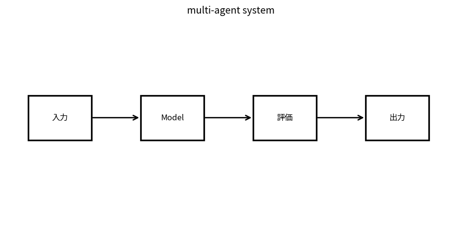

# multi-agent system

Course 10｜Frontier｜Topic 10/20

---
layout: center
---

## 今回の問い

## 到達目標

- 定義と代表式を、自分の言葉と記号で説明できる。
- 成立条件を確認し、手計算と結果を検算できる。

## 理解確認

- 定義・条件・計算結果を自分の言葉で説明できるか確認する。

multi-agent systemの代表式は、どの定義・仮定から、なぜその形になるのか。

---

## なぜ今これを学ぶのか

前Topic `frontier-agents-planning-memory` で得た概念を使い、ここでは multi-agent system へ進む。

---

## 直感

multi-agent systemでは複数agentのpolicyが互いの結果へ影響し、協調・競争・通信設計が重要になる。

---

## 図解

複数agentと共有環境のmessage流れを描く。 複数agentが異なる役割・状態を持ち、messageや共有環境を介して相互作用する。agent数を増やすだけでは協調が保証されず、通信protocolと責任分担が必要になる。

---

## 記号と代表式

- $\pi_i$：agent i policy
- $U_i$：utility/objective
- $m_{ij}$：messages
- $n$：agents

$$
\max_{\pi_1,\ldots,\pi_n}\sum_i U_i(\pi_1,\ldots,\pi_n)
$$

---

## 導出 1

outcomeは $(\pi_1,\ldots,\pi_n)$ の相互作用に依存。各agent optimumがglobal optimumと一致するとは限らない。

---

## 導出 2

task decompositionでparallelism/専門化できるが、subtask interfacesとshared constraintsが必要。

---

## 例題

researcher→critic→synthesizer rolesでindependent evidence collectionとreviewを分担。

---

## 条件を変えるとどうなるか

majority voteはagents errorsがstrongly correlatedなら改善しない。

---

## よくある誤解

multi-agent systemでは、式へ数値を代入するだけでは不十分である。majority voteはagents errorsがstrongly correlatedなら改善しない。 という失敗例が示すように、式を使える条件と結論の範囲を区別する必要がある。

---

## 実装・計算上の注意

role prompt、shared memory permissions、message protocol、termination/arbiter、cost attribution。

---

## 一段先へ

behaviorをhuman preferenceへadaptするRLHF/preference optimizationへ。

---

## 自分で説明できるか

- 「joint policy」を式を見ずに説明できるか
- 「coordination cost」までの論理を一段ずつ再現できるか
- multi-agent systemの条件を1つ外した反例を説明できるか

---
layout: center
---

## 教科書と演習

- [教科書](../../textbook/frontier-multi-agent-systems)
- [10問の演習](../../exercises/frontier-multi-agent-systems)
