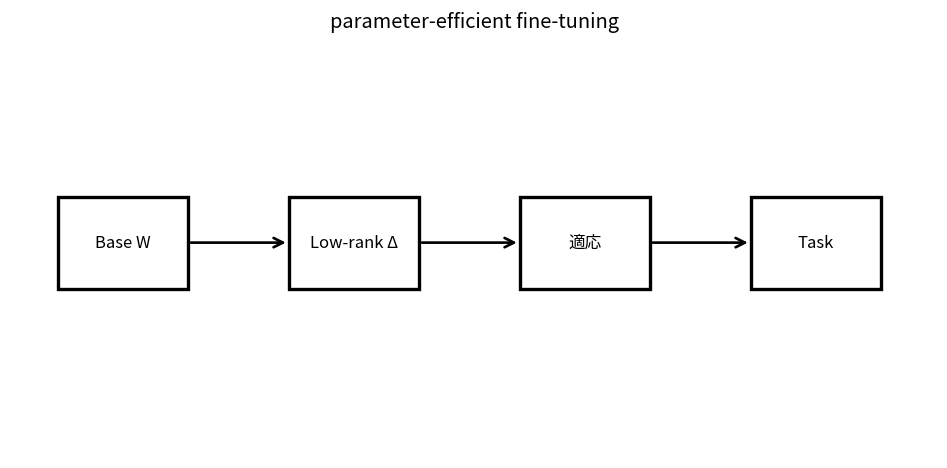

# parameter-efficient fine-tuning

Course 10｜Frontier｜Topic 05/20

---
layout: center
---

## 今回の問い

## 到達目標

- 定義と代表式を、自分の言葉と記号で説明できる。
- 成立条件を確認し、手計算と結果を検算できる。

## 理解確認

- 定義・条件・計算結果を自分の言葉で説明できるか確認する。

parameter-efficient fine-tuningの代表式は、どの定義・仮定から、なぜその形になるのか。

---

## なぜ今これを学ぶのか

前Topic `frontier-in-context-learning-prompting` で得た概念を使い、ここでは parameter-efficient fine-tuning へ進む。

---

## 直感

parameter-efficient fine-tuningは基礎weightを固定し、小さい追加parameterだけ学習してtaskへ適応する。

---

## 図解

大きなWに低rank BAを加えるブロック図を見る。 固定した大きな重みWに低rank補正BAを足す。rank rを小さくすると学習parameterは大幅に減るが、更新方向はその低次元部分空間に制限される。

---

## 記号と代表式

- $W\in\mathbb R^{d_o\times d_i}$：frozen base weight
- $A\in\mathbb R^{r\times d_i}$
- $B\in\mathbb R^{d_o\times r}$
- $\Delta W=(\alpha/r)BA$
- $r\ll\min(d_i,d_o)$

$$
\mathbf{W}^{\prime}=\mathbf{W}+\frac{\alpha}{r}\mathbf{B}\mathbf{A}
$$

---

## 導出 1

adaptationに必要なweight changeがfull rankを必要としないと仮定し、ΔW=BA。rank(BA)≤r。

---

## 導出 2

full d_od_iに対しLoRAはr(d_i+d_o)。rが小さいほど大幅削減。

---

## 例題

4096×4096 layerのfull update約16.8M paramsに対しr=8なら65,536 trainable params（bias等除く）。

---

## 条件を変えるとどうなるか

low-rank adapterが全taskでfull fine-tuningと同品質になる保証はない。rank/location/data量でcapacity不足。

---

## よくある誤解

parameter-efficient fine-tuningでは、式へ数値を代入するだけでは不十分である。low-rank adapterが全taskでfull fine-tuningと同品質になる保証はない。rank/location/data量でcapacity不足。 という失敗例が示すように、式を使える条件と結論の範囲を区別する必要がある。

---

## 実装・計算上の注意

target modules、rank、alpha、dropout、base quantization、adapter mergeを記録。trainable param countをverify。

---

## 一段先へ

weightsへ知識を入れず、query時に外部文書を検索してcontextへ供給するRAGへ。

---

## 自分で説明できるか

- 「low-rank hypothesis」を式を見ずに説明できるか
- 「scaled update」までの論理を一段ずつ再現できるか
- parameter-efficient fine-tuningの条件を1つ外した反例を説明できるか

---
layout: center
---

## 教科書と演習

- [教科書](../../textbook/frontier-parameter-efficient-finetuning)
- [10問の演習](../../exercises/frontier-parameter-efficient-finetuning)
