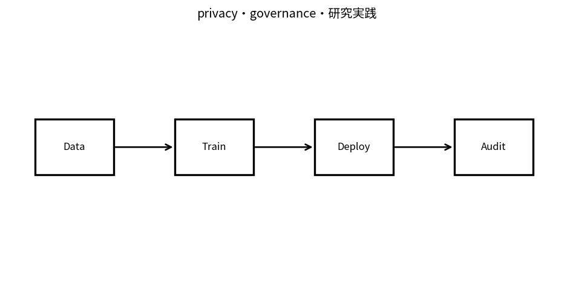

# privacy・governance・研究実践

Course 10｜Frontier｜Topic 20/20

---
layout: center
---

## 今回の問い

## 到達目標

- 定義と代表式を、自分の言葉と記号で説明できる。
- 成立条件を確認し、手計算と結果を検算できる。

## 理解確認

- 定義・条件・計算結果を自分の言葉で説明できるか確認する。

privacy・governance・研究実践の代表式は、どの定義・仮定から、なぜその形になるのか。

---

## なぜ今これを学ぶのか

前Topic `frontier-scientific-machine-learning` で得た概念を使い、ここでは privacy・governance・研究実践 へ進む。

---

## 直感

privacyとgovernanceはmodel性能だけでなく、data access、risk、audit、再現性をsystemとして管理する。

---

## 図解

data→training→deployment→auditのlifecycleを描く。 data収集、学習、評価、deployment、monitoringの各段階にprivacy・権限・auditのcontrol pointを置く。技術対策と運用制度を別レイヤで管理する。

---

## 記号と代表式

- $D,D^{\prime}$：1 recordだけ異なるneighboring datasets
- $M$：randomized mechanism
- $(\varepsilon,\delta)$：differential privacy parameters
- $S$：output event

$$
\mathbb{P}(M(D)\in S)\le e^{\varepsilon}\mathbb{P}(M(D^{\prime})\in S)+\delta
$$

---

## 導出 1

1人のrecord有無で $P(M(D)\in S)$ と $P(M(D\prime)\in S)$ を全Sで比較。

---

## 導出 2

$P_D(S)\le e^\varepsilon P_{D\prime}(S)+\delta$。ε小ほどdistributionsが近くsingle-record influenceを制限。

---

## 例題

DP-SGDはper-example gradient clipping+noiseでtraining mechanismのprivacyをboundし、accountantでεを算定。

---

## 条件を変えるとどうなるか

「dataを匿名化した」だけでre-identification riskがゼロとは限らない。DP guaranteeとheuristic de-identificationを区別。

---

## よくある誤解

privacy・governance・研究実践では、式へ数値を代入するだけでは不十分である。「dataを匿名化した」だけでre-identification riskがゼロとは限らない。DP guaranteeとheuristic de-identificationを区別。 という失敗例が示すように、式を使える条件と結論の範囲を区別する必要がある。

---

## 実装・計算上の注意

privacy accountant assumptions、access logs、retention、consent/license、incident response、reproducible research artifact。

---

## 一段先へ

Course 10の終点では、新手法を追う際も「定義→仮定→実験設計→uncertainty→failure mode→governance」の順序で検証する習慣を残す。

---

## 自分で説明できるか

- 「neighbor comparison」を式を見ずに説明できるか
- 「composition」までの論理を一段ずつ再現できるか
- privacy・governance・研究実践の条件を1つ外した反例を説明できるか

---
layout: center
---

## 教科書と演習

- [教科書](../../textbook/frontier-privacy-governance-research-practice)
- [10問の演習](../../exercises/frontier-privacy-governance-research-practice)
