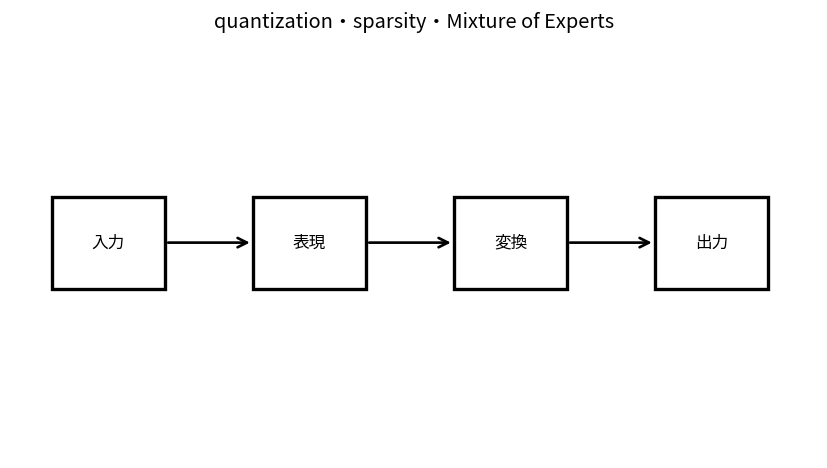

# quantization・sparsity・Mixture of Experts

Course 10｜Frontier｜Topic 16/20

---
layout: center
---

## 今回の問い

## 到達目標

- 定義と代表式を、自分の言葉と記号で説明できる。
- 成立条件を確認し、手計算と結果を検算できる。

## 理解確認

- 定義・条件・計算結果を自分の言葉で説明できるか確認する。

quantization・sparsity・Mixture of Expertsの代表式は、どの定義・仮定から、なぜその形になるのか。

---

## なぜ今これを学ぶのか

前Topic `frontier-uncertainty-calibration-abstention` で得た概念を使い、ここでは quantization・sparsity・Mixture of Experts へ進む。

---

## 直感

効率化は精度を保ちながらparameter数、bit幅、active expert、計算量を減らす。

---

## 図解

dense modelとlow-rank/quantized/MoEの計算ブロックを比較する。 大きな重み行列全体を更新せず、低rank補正など少数parameterだけを学習する経路を描く。計算・memory削減と表現力の交換がある。

---

## 記号と代表式

- $b$：quantization bit width
- $W_q$：quantized weights
- $g_e(x)$：expert routing weights
- $TopK$：selected experts

$$
\mathbf{y}=\sum_{e\in\operatorname{TopK}(g(\mathbf{x}))}g_e(\mathbf{x})f_e(\mathbf{x})
$$

---

## 導出 1

continuous weight rangeをfinite levelsへmap。scale/zero-point等でdequantize approximationしmemory bandwidth削減。

---

## 導出 2

zero weights/activationsをskipできればcompute削減。ただしhardware kernelがstructureを利用できる必要。

---

## 例題

FP16→INT8でweight storage概ねhalfだがscales/metadata/kernel overheadありexact latencyはhardware依存。

---

## 条件を変えるとどうなるか

parameter countとFLOPsだけでlatencyを予測できない。memory movement/communication/router imbalance。

---

## よくある誤解

quantization・sparsity・Mixture of Expertsでは、式へ数値を代入するだけでは不十分である。parameter countとFLOPsだけでlatencyを予測できない。memory movement/communication/router imbalance。 という失敗例が示すように、式を使える条件と結論の範囲を区別する必要がある。

---

## 実装・計算上の注意

quality vs p50/p99 latency, throughput, peak memory, energy、hardware-specific kernelsでbenchmark。

---

## 一段先へ

sequence length自体がattention costを増やすためlong context/memory architectureへ。

---

## 自分で説明できるか

- 「quantization」を式を見ずに説明できるか
- 「MoE」までの論理を一段ずつ再現できるか
- quantization・sparsity・Mixture of Expertsの条件を1つ外した反例を説明できるか

---
layout: center
---

## 教科書と演習

- [教科書](../../textbook/frontier-quantization-sparsity-moe)
- [10問の演習](../../exercises/frontier-quantization-sparsity-moe)
