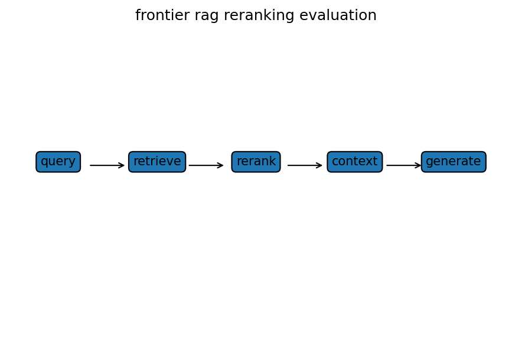

# RAG：chunking・reranking・評価

Course 10｜Frontier

---

## 何を解決するか

RAGの失敗をretrieval・reranking・generationへ分解して、どこが悪いか測るにはどうするか。

最終回答だけを見ると原因が分からない。まず必要根拠をtop-kへ取れたか、rerankerが上位へ持ち上げたか、generatorが根拠を正しく使ったかを分離評価する。

---

## 図の意味

query→retriever→candidate passages→reranker→context→generatorという5段階。retrieverの下にRecall@k、rerankerの下にMRR/nDCG、generatorの下にanswer correctness/faithfulnessを置き、end-to-end失敗をどの段で生じたか切り分ける。

---

## 記号

| 記号 | 意味 |
|---|---|
| $Recall@k$ | 必要文書がtop-kへ入る割合 |
| $MRR$ | 最初の関連文書順位の逆数平均 |
| $faithfulness$ | 回答が根拠に支持される度合い |

- k：retrieval候補数。
- Recall@k：relevant itemのcoverage。
- MRR：最初のrelevant item順位の逆数の平均。
- faithfulness：回答がcontextに支持される度合い。

---

## 中心式

$$
\mathrm{Recall@}k=\frac{|\text{relevant}\cap\text{top-}k|}{|\text{relevant}|}
$$

---

## 導出

1. query→candidate retrievalを第一段階として測る。
2. reranking後のranking metricを別に測る。
3. retrieved contextを固定してgeneration quality/faithfulnessを評価し、end-to-end errorを分解する。

---

## 省略しない一段

retrieval段階では必要documentが候補集合へ入らなければ後段は救えないのでRecall@kが重要。rerankerはcandidate内の順序を改善し、限られたcontext windowへ最重要chunkを上位に置く。

generation evaluationではgold passageをoracle contextとして与えた性能と、実retrieval contextでの性能を比較するとretrieval lossを分離できる。faithfulnessは「回答がcontextに支持されるか」で、answer correctnessとは別指標。

---

## 手計算

**問題**：relevant passageが全部で5個、top-10 retrievalに4個入った。Recall@10を求める。さらに最初のrelevantがrank3ならreciprocal rankを求めよ。

**解答**：Recall@10=4/5=0.8。first relevant rank=3なので reciprocal rank=1/3≈0.333。retrieval coverageとranking qualityは別指標。

---

## 条件を変える

gold relevant passagesが4個中top-5に3個ならRecall@5=3/4=0.75。goldがtop-5にあるのにanswerが誤りならgenerator/reader側、gold自体が無ければretrieval側を優先修正する。

---

## どこで壊れるか

chunkを細かくしすぎるとsemantic contextが切れ、粗すぎるとembeddingが平均化される。offline retrieval metricだけ改善しても最終answer metricが必ず上がるとは限らない。

---

## 次へ

hybrid sparse+dense retrieval、cross-encoder reranking、query rewriting、RAGAS型evaluation、agentic retrievalへ発展する。

---

[教科書](../../textbook/frontier-rag-reranking-evaluation)　|　[10問の演習](../../exercises/frontier-rag-reranking-evaluation)
