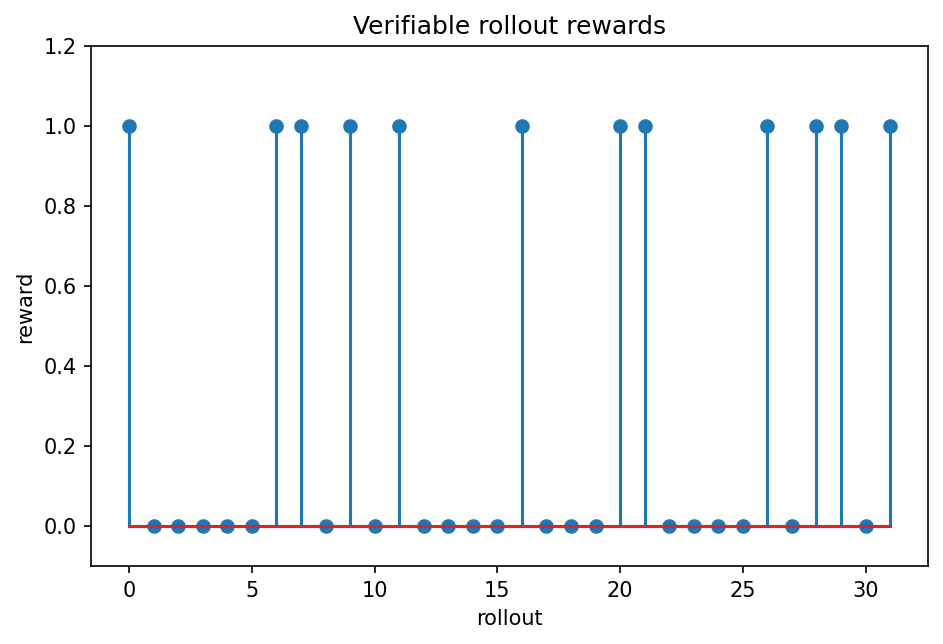

# 推論RLとverifiable reward

Course 10｜Frontier

---

## 何を解決するか

数学・codingのように答えを自動検証できる課題では、preference modelを介さずどのようにRL信号を作れるか。

verifiable taskでは最終答案の正誤、unit test、formal checkerなどをrewardとして使える。人間preferenceより低コストで大量sampleを評価できる一方、reward仕様の範囲外の品質は保証しない。

---

## 図の意味

複数のrolloutを横に並べ、verifierが各responseへ0/1または連続rewardを返す。正解rolloutと不正解rolloutのreward差がpolicy update信号になる。人間rankではなくunit test・symbolic checker等が直接評価する点を示す。

---

## 記号

| 記号 | 意味 |
|---|---|
| $r(x,y)$ | 検証器からのreward |
| $G$ | group/rollout集合 |
| $A_i$ | 各sampleのadvantage相当量 |

- $x$：問題prompt、$y$：sampled rollout/response。
- $r(x,y)$：verifierが返すreward。
- $\pi_\theta$：更新するpolicy。

---

## 中心式

$$
\max_\theta\;E_{y\sim\pi_\theta(\cdot|x)}[r(x,y)]\quad\text{with policy regularization}
$$

---

## 導出

1. promptから複数rolloutをsampleする。
2. verifierで各responseへrewardを付ける。
3. relative/normalized rewardをpolicy gradient estimatorへ入れ、policy collapseを防ぐregularizationと併用する。

---

## 省略しない一段

verifiable taskではreward function $r(x,y)$ を自動計算できる。policyから複数responseをsampleし、group内でrewardをcenter/normalizeしてadvantage相当の信号を作り、log-policy gradientで確率を更新する手法が使える。

重要なのは「verifierが測れること」と「望ましい推論のすべて」が同じではないこと。final answerだけをrewardすると、途中 reasoningのfaithfulnessやstyle、安全性はobjectiveに含まれない。policy regularizationやdiversity確保が必要。

---

## 手計算

**問題**：4 rolloutのrewardが [1,1,0,0]。group meanをbaselineとしてcentered rewardを求めよ。

**解答**：平均は0.5。centered rewardは [0.5,0.5,-0.5,-0.5]。正解rolloutのlog-probabilityを相対的に上げ、不正解を下げる信号になる。

---

## 条件を変える

8 rollout中3本がchecker正解でreward1、5本が0。group平均0.375なら、正解rolloutのcentered rewardは+0.625、不正解は-0.375。これをlog-prob gradientへ掛けると相対的に正解trajectoryを上げる。

---

## どこで壊れるか

verifier loopholeがあるとreward hackingが起きる。unit testが不十分ならtestだけ通す不正実装を高rewardにしてしまう。reward specificationそのものを検証する必要がある。

---

## 次へ

RLHFのpreference rewardと同じpolicy optimization基盤を使いつつ、feedback sourceが自動verifierへ変わる。reasoning model evaluationではpass@kとsample diversityも重要。

---

[教科書](../../textbook/frontier-reasoning-rl-rlvr)　|　[10問の演習](../../exercises/frontier-reasoning-rl-rlvr)
