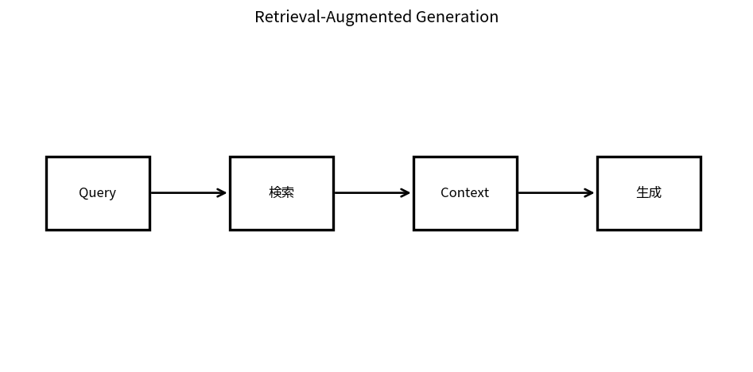

# Retrieval-Augmented Generation

Course 10｜Frontier｜Topic 06/20

---
layout: center
---

## 今回の問い

## 到達目標

- 定義と代表式を、自分の言葉と記号で説明できる。
- 成立条件を確認し、手計算と結果を検算できる。

## 理解確認

- 定義・条件・計算結果を自分の言葉で説明できるか確認する。

Retrieval-Augmented Generationの代表式は、どの定義・仮定から、なぜその形になるのか。

---

## なぜ今これを学ぶのか

前Topic `frontier-parameter-efficient-finetuning` で得た概念を使い、ここでは Retrieval-Augmented Generation へ進む。

---

## 直感

RAGはqueryで外部文書を検索し、取得文書をcontextへ入れて生成することで知識を補う。

---

## 図解

query→embedding→retrieval→context→generationを段階表示する。 queryからretrieverが外部文書を選び、その文書をcontextとしてgeneratorへ渡す。最終出力はparameter内部知識だけでなく検索結果に条件づけられる。

---

## 記号と代表式

- $x$：query
- $d$：retrieved document/chunk
- $\mathcal D_k$：top-k retrieved set
- $p(d|x)$：retriever weight
- $p(y|x,d)$：generator

$$
p(y\mid x)=\sum_{d\in\mathcal{D}_k}p(y\mid x,d)p(d\mid x)
$$

---

## 導出 1

dが未確定ならtotal probabilityにより $p(y|x)=\sum_d p(y,d|x)=\sum_dp(y|x,d)p(d|x)$。

---

## 導出 2

全corpus sumは不可能なのでretrieverが高score dだけ $\mathcal D_k$ へ絞る。ここでretrieval recall lossが入る。

---

## 例題

質問に対しcorrect manual sectionがtop-3に入ればgeneratorは引用付き回答可能。top-k全てirrelevantならgeneratorだけで事実を回復する保証なし。

---

## 条件を変えるとどうなるか

RAGを使えばhallucinationが自動消滅するわけではない。retrieved evidenceを無視/誤解釈/誤引用し得る。

---

## よくある誤解

Retrieval-Augmented Generationでは、式へ数値を代入するだけでは不十分である。RAGを使えばhallucinationが自動消滅するわけではない。retrieved evidenceを無視/誤解釈/誤引用し得る。 という失敗例が示すように、式を使える条件と結論の範囲を区別する必要がある。

---

## 実装・計算上の注意

retrieval hit@k, MRR, answer correctness, citation supportを別metric。chunking/index version/corpus snapshotを記録。

---

## 一段先へ

retrieverの基盤となるdense vector similarityとapproximate nearest-neighbor indexを次に分解する。

---

## 自分で説明できるか

- 「documentをlatent evidenceとみなす」を式を見ずに説明できるか
- 「context generation」までの論理を一段ずつ再現できるか
- Retrieval-Augmented Generationの条件を1つ外した反例を説明できるか

---
layout: center
---

## 教科書と演習

- [教科書](../../textbook/frontier-retrieval-augmented-generation)
- [10問の演習](../../exercises/frontier-retrieval-augmented-generation)
