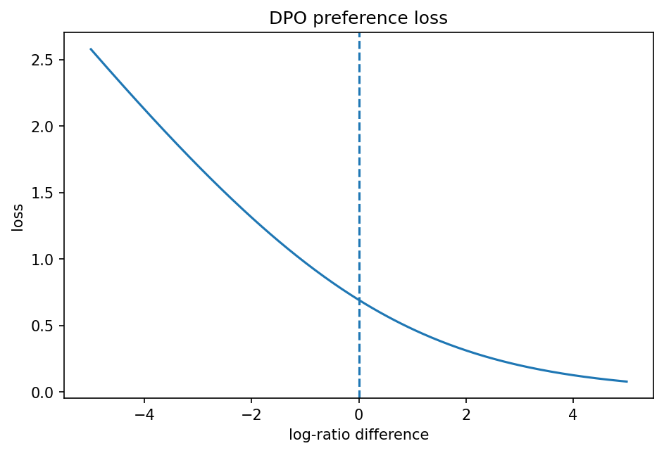

# RLHFとpreference optimization

Course 10｜Frontier｜Topic 11/20

---
layout: center
---

## 今回の問い

## 到達目標

- 定義と代表式を、自分の言葉と記号で説明できる。
- 成立条件を確認し、手計算と結果を検算できる。

## 理解確認

- 定義・条件・計算結果を自分の言葉で説明できるか確認する。

RLHFとpreference optimizationの代表式は、どの定義・仮定から、なぜその形になるのか。

---

## なぜ今これを学ぶのか

前Topic `frontier-multi-agent-systems` で得た概念を使い、ここでは RLHFとpreference optimization へ進む。

---

## 直感

preference optimizationは候補応答の比較データから、望ましい応答を相対的に高確率にする。

---

## 図解

chosen/rejected pairからpolicy更新へ流れるpipelineを描く。 同じpromptへの複数応答の選好比較から、望ましい出力方向を学ぶ。DPO等では選好された応答と非選好応答の相対log-probabilityを直接最適化する。

---

## 記号と代表式

- $x$：prompt
- $y_w,y_l$：preferred/rejected responses
- $\pi_\theta$：policy
- $\pi_{ref}$：reference policy
- $\beta$：deviation strength

$$
\mathcal{L}_{DPO}=-\log\sigma(\beta[\log\pi_\theta(y_w\mid x)-\log\pi_\theta(y_l\mid x)-\Delta_{ref}])
$$

---

## 導出 1

absolute scoreより $P(y_w\succ y_l|x)$ をmodel化。Bradley–Terry型でreward differenceをsigmoidへ。

---

## 導出 2

KL-regularized optimal policyではrewardが $\beta\log[\pi^*(y|x)/\pi_{ref}(y|x)]$ とconstantで表せる。

---

## 例題

same promptにhelpful correct responseとless preferred response pairを作り、preferred log-ratioをreference relativeに増やす。

---

## 条件を変えるとどうなるか

preference data自体がbiased/inconsistentならoptimizerはそのbiasを学ぶ。preference=ground-truth safetyではない。

---

## よくある誤解

RLHFとpreference optimizationでは、式へ数値を代入するだけでは不十分である。preference data自体がbiased/inconsistentならoptimizerはそのbiasを学ぶ。preference=ground-truth safetyではない。 という失敗例が示すように、式を使える条件と結論の範囲を区別する必要がある。

---

## 実装・計算上の注意

pair construction、reference model version、length bias、chosen/rejected leakage、reward/eval separation。

---

## 一段先へ

preference optimizationはalignmentの一手段。policy constraints、red teaming、system safetyを広く次Topicで扱う。

---

## 自分で説明できるか

- 「relative preference」を式を見ずに説明できるか
- 「DPO objective」までの論理を一段ずつ再現できるか
- RLHFとpreference optimizationの条件を1つ外した反例を説明できるか

---
layout: center
---

## 教科書と演習

- [教科書](../../textbook/frontier-rlhf-preference-optimization)
- [10問の演習](../../exercises/frontier-rlhf-preference-optimization)
