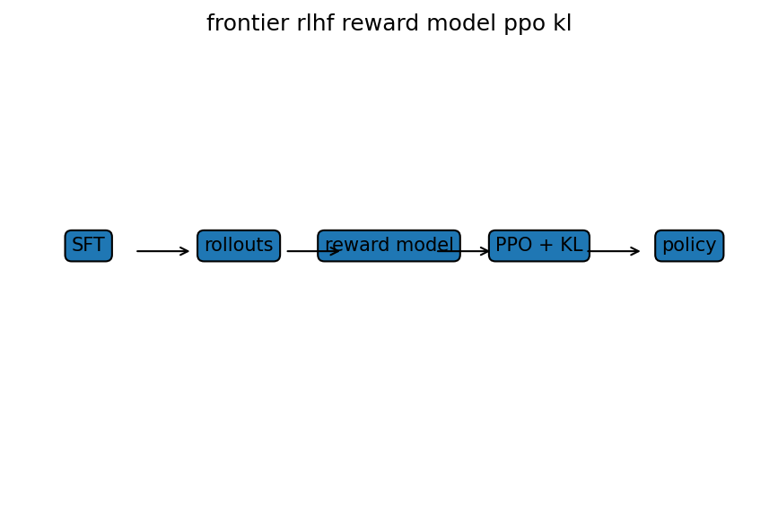

# RLHF：reward model・PPO・KL制御

Course 10｜Frontier

---

## 今回の問い

人間のpairwise preferenceをrewardへ変換し、policyをreferenceから離しすぎず改善する標準RLHF pipelineはどうつながるか。

---

## 直感

まずchosen/rejected比較からreward modelを学び、そのrewardを最大化するようpolicyをRLで更新する。ただしreward modelの穴を突くoveroptimizationを抑えるためreference policyとのKL penaltyを使う。

---

## 図解

---

## 中心式

$$
J(\theta)=E_{y\sim\pi_\theta}[r_\phi(x,y)]-\beta D_{KL}(\pi_\theta(\cdot|x)\|\pi_{ref}(\cdot|x))
$$

---

## 導出

1. pairwise preferenceをBradley–Terry型 $P(y_w\succ y_l)=σ(r_w-r_l)$ で学習する。
2. learned rewardをRL objectiveにする。
3. KL penaltyでreferenceからのdistribution shiftを制限し、PPO等で近似更新する。

---

## 小さい例

同一promptに複数応答を生成し、人間rankからreward modelを作り、policy rollout→reward→PPO updateを反復する。

---

## 条件を外すと

- reward model scoreをground truth utilityとみなさない。
- KL係数とreward scaleのconventionを明示する。

---

## 理解確認

- 式の各記号を定義できるか。
- 導出を1段ずつ再現できるか。
- 反例を1つ作れるか。

---

## 教科書と演習

[教科書](../../textbook/frontier-rlhf-reward-model-ppo-kl)

[10問の演習](../../exercises/frontier-rlhf-reward-model-ppo-kl)
