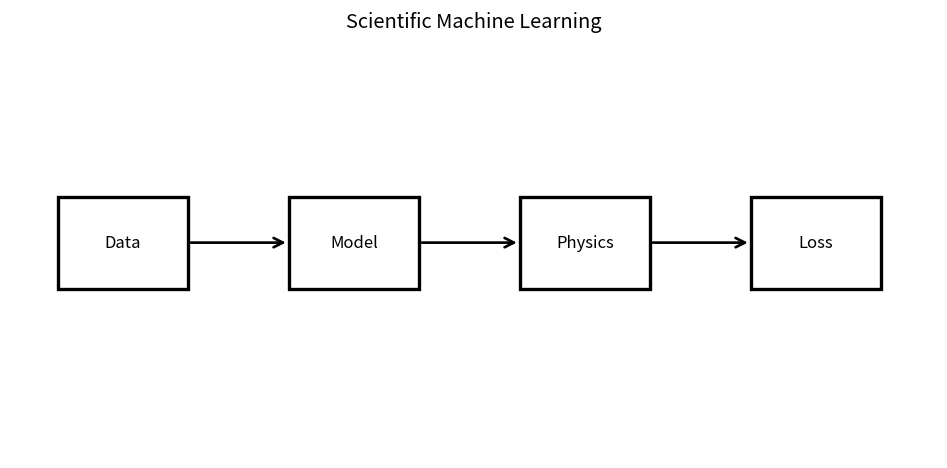

# Scientific Machine Learning

Course 10｜Frontier｜Topic 19/20

---
layout: center
---

## 今回の問い

## 到達目標

- 定義と代表式を、自分の言葉と記号で説明できる。
- 成立条件を確認し、手計算と結果を検算できる。

## 理解確認

- 定義・条件・計算結果を自分の言葉で説明できるか確認する。

Scientific Machine Learningの代表式は、どの定義・仮定から、なぜその形になるのか。

---

## なぜ今これを学ぶのか

前Topic `frontier-synthetic-data-data-curation` で得た概念を使い、ここでは Scientific Machine Learning へ進む。

---

## 直感

Scientific MLは観測dataのlossと物理法則・方程式の残差を同時に最小化して、data不足を構造知識で補う。

---

## 図解

data pointとphysics residualを同じ目的関数へ合流させる。 物理・科学modelが与える制約とdata-driven modelを同じ計算graphで結ぶ。単なる予測精度だけでなく保存則・境界条件・不確実性も評価対象になる。

---

## 記号と代表式

- $L_{data}$：observation fit
- $L_{physics}$：equation/constraint residual
- $\lambda$：balance
- $u_\theta$：learned field/model

$$
\mathcal{L}=\mathcal{L}_{data}+\lambda\mathcal{L}_{physics}
$$

---

## 導出 1

PDE/ODE $F[u]=0$ にmodel $u_θ$ を代入しcollocation pointsで $r=F[u_θ]$。autodiffでderivatives計算。

---

## 導出 2

$L=L_{data}+λL_{physics}$。λはunits/scale/optimization dynamicsを調整。

---

## 例題

heat equationのtemperature fieldをsparse measurementsとPDE residualからfit。

---

## 条件を変えるとどうなるか

physics lossが小さい=真のphysical solution一意とは限らない。boundary/initial conditions、model error、identifiabilityが必要。

---

## よくある誤解

Scientific Machine Learningでは、式へ数値を代入するだけでは不十分である。physics lossが小さい=真のphysical solution一意とは限らない。boundary/initial conditions、model error、identifiabilityが必要。 という失敗例が示すように、式を使える条件と結論の範囲を区別する必要がある。

---

## 実装・計算上の注意

units/non-dimensionalization、collocation sampling、residual scales、baseline numerical solver comparison。

---

## 一段先へ

最後にprivacy/governance/research practiceでtechnical performance以外のconstraintsとevidence standardsを統合する。

---

## 自分で説明できるか

- 「governing equation residual」を式を見ずに説明できるか
- 「inverse problem」までの論理を一段ずつ再現できるか
- Scientific Machine Learningの条件を1つ外した反例を説明できるか

---
layout: center
---

## 教科書と演習

- [教科書](../../textbook/frontier-scientific-machine-learning)
- [10問の演習](../../exercises/frontier-scientific-machine-learning)
