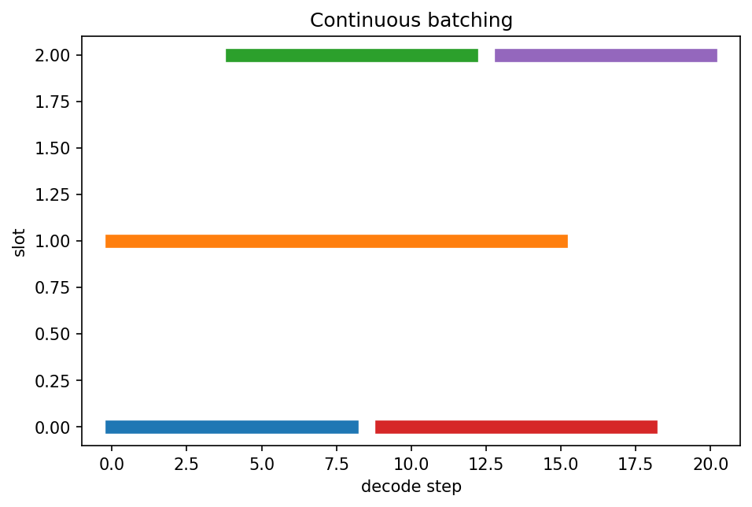

# LLM serving・continuous batching・speculative decoding

Course 10｜Frontier

---

## 何を解決するか

複数requestを低latencyかつ高throughputで処理するため、serving systemは何をscheduleするか。

requestごとに生成長が違うため固定batchはGPU slotを無駄にしやすい。continuous batchingはdecode step単位でrequestを入替える。speculative decodingは小modelのdraftを大modelがまとめて検証する。

---

## 図の意味

縦軸がbatch slot、横軸がdecode step。各requestの横棒は開始時刻と終了時刻が異なり、終了したslotへ途中から新requestが入る。固定batchのように最長requestの終了まで待たず、step境界で入れ替えるcontinuous batchingを示す。

---

## 記号

| 記号 | 意味 |
|---|---|
| $TTFT$ | time to first token |
| $ITL$ | inter-token latency |
| $draft model$ | 候補tokenを先に提案するmodel |

- TTFT：time to first token。
- TPOT：time per output token。
- throughput：単位時間あたり処理token数。
- acceptance rate：draft tokenがtarget検証で受理される割合。

---

## 中心式

$$
\text{throughput}\not\equiv\text{latency};\quad \text{servingは両者のtrade-offを最適化する}
$$

---

## 導出

1. decode requestをstepごとのwork itemへ分解する。
2. finished requestをすぐbatchから除き新requestを投入する。
3. speculative decodingではdraft token列をtarget modelで並列検証し、受理分だけ進める。

---

## 省略しない一段

autoregressive decodeではrequestごとに1stepずつworkが発生する。static batchingだと短いrequestが終わってもslotが遊ぶ。continuous batchingは各iterationでactive sequence集合を更新してGPUを埋める。

speculative decodingは小さなdraft modelでk token候補を出し、大きなtarget modelがまとめて検証する。受理判定を正しく設計すればtarget distributionを保ったまま複数token進める可能性がある。速度向上はdraft costとacceptance rateに依存する。

---

## 手計算

**問題**：draftが5 token提案し、各blockで平均4 token受理される。target model call 1回あたり平均何token進むか。draft costを無視した理想speedup上限も答えよ。

**解答**：平均4 token進む。通常decodeはtarget call 1回で1 tokenなので、draft costとverification overheadを無視した理想上限は約4倍。

---

## 条件を変える

draftが4 token提案し平均3 token受理され、target verificationが通常1stepと近いcostなら、理想的にはtarget callあたり約3 token進む。ただしdraft計算・rejection rollbackがあるので実speedupは3倍未満。

---

## どこで壊れるか

throughput最大化のため巨大batchにするとTTFT/latencyが悪化する。servingはtokens/sだけでなくp50/p95 latency、queueing、memory headroomを同時に見る。

---

## 次へ

prefill/decode disaggregation、scheduler policy、tensor/pipeline parallel、load balancingへ広がる。production LLMではmodel algorithmとsystems metricを分離して評価する必要がある。

---

[教科書](../../textbook/frontier-serving-batching-speculative-decoding)　|　[10問の演習](../../exercises/frontier-serving-batching-speculative-decoding)
